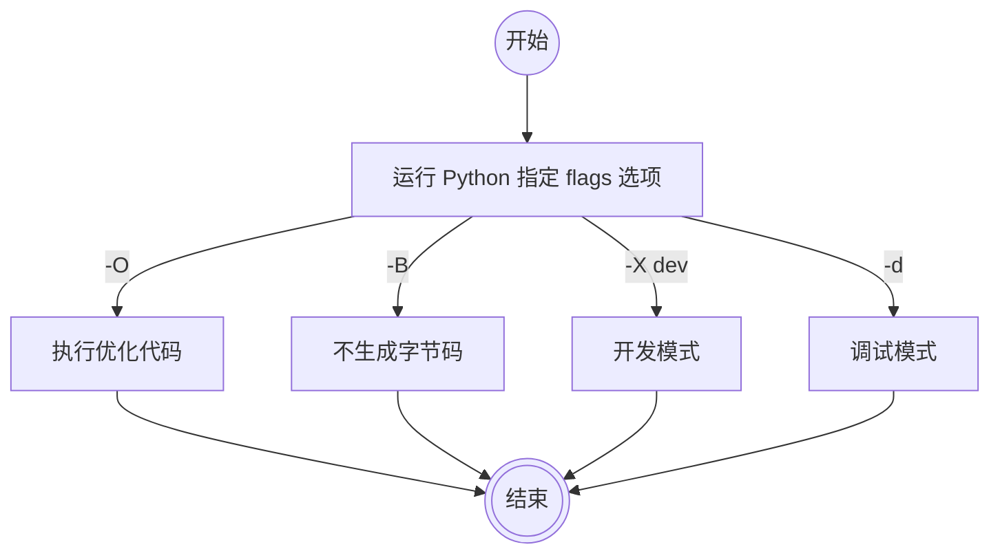

[10.3. Command Line Arguments](https://docs.python.org/3.7/tutorial/stdlib.html#command-line-arguments)  

argparse — Parser for command-line options, arguments and sub-commands

[argparse](https://docs.python.org/3/library/argparse.html?highlight=textiowrapper)  
[Argparse Tutorial](https://docs.python.org/3/howto/argparse.html)  

[How to Build Command Line Interfaces in Python With argparse](https://realpython.com/command-line-interfaces-python-argparse/)  

## argparse vs. optparse

[Why use argparse rather than optparse?](https://stackoverflow.com/questions/3217673/why-use-argparse-rather-than-optparse)

[Python中optparse(2.7版本后将被移除)转到argparse](https://blog.csdn.net/AnthongDai/article/details/78857177)  
[Python 的命令行参数处理 optparse->argparse](https://www.cnblogs.com/raybiolee/p/4225362.html)  

## argparse-命令行与参数解析

[argparse — 命令行选项、参数和子命令的解析器](https://www.cnblogs.com/xiaofeiIDO/p/6154953.html)

[Python中最好用的命令行参数解析工具](https://juejin.im/post/5c6958fd6fb9a049ff4eab60)  

### ArgumentParser

创建一个新的 ArgumentParser 对象。所有的参数应该以关键字参数传递。
下面有对每个参数各自详细的描述，但是简短地讲它们是：

- prog - 程序的名字（默认：sys.argv[0]）  
- usage - 描述程序用法的字符串（默认：从解析器的参数生成）  
- description - 参数帮助信息之前的文本（默认：空）  
- epilog - 参数帮助信息之后的文本（默认：空）  
- parents - ArgumentParser 对象的一个列表，这些对象的参数应该包括进去  
- formatter_class - 定制化帮助信息的类  
- prefix_chars - 可选参数的前缀字符集（默认：‘-‘）  
- fromfile_prefix_chars - 额外的参数应该读取的文件的前缀字符集（默认：None）  
- argument_default - 参数的全局默认值（默认：None）  
- conflict_handler - 解决冲突的可选参数的策略（通常没有必要）  
- add_help - 给解析器添加-h/–help 选项（默认：True）  

默认 add_help = True，会添加一个 `-h/--help` 选项。

比较常用的是 description 和 epilog。

#### formatter_class

[Python argparse: How to insert newline in the help text?](https://stackoverflow.com/questions/3853722/python-argparse-how-to-insert-newline-in-the-help-text)

```
formatter_class=argparse.RawTextHelpFormatter
```

### add_argument()

ArgumentParser.add_argument 方法定义应该如何解析一个命令行参数。

下面每个参数有它们自己详细的描述，简单地讲它们是：

- name or flags - 选项字符串的名字或者列表，例如 `foo` 或者 `-f`, `--foo`。  
- action - 在命令行遇到该参数时采取的基本动作类型。  
- nargs - 应该读取的命令行参数数目。  
- const - 某些action和nargs选项要求的常数值。  
- default - 如果命令行中没有出现该参数时的默认值。  
- type - 命令行参数应该被转换成的类型。  
- choices - 参数可允许的值的一个容器。  
- required - 该命令行选项是否可以省略（只针对可选参数）。  
- help - 参数的简短描述。  
- metavar - 参数在帮助信息中的名字。  
- dest - 给 parse_args() 返回的对象要添加的属性名称。  

#### version

最新的 argparser 不支持直接赋值 `.version = '1.0'`，而是通过 `--version` 指定。

[Python's argparse to show program's version with prog and version string formatting](https://stackoverflow.com/questions/15405636/pythons-argparse-to-show-programs-version-with-prog-and-version-string-formatt)

以下是官网示例：

```Python
import argparse
parser = argparse.ArgumentParser(prog='PROG')
parser.add_argument('--version', action='version', version='%(prog)s 2.0')
parser.parse_args(['--version'])
PROG 2.0
```

#### Name or Flags

Setting the Name or Flags of the Arguments

The first arguments passed to `add_argument()` must therefore be either a *series* of flags, or a *simple* argument name. 

For example, an optional argument could be created like:

```
parser.add_argument('-f', '--foo')
```

while a positional argument could be created like:

```
parser.add_argument('bar')
```

---

There are basically two different types of arguments that you can add to your command line interface:

1. Positional arguments  
2. Optional arguments  

**Positional** arguments are the ones your command needs to operate. -- `required=True`

In the previous example, the argument `path` was a positional argument, and our program couldn’t work without it.  
They are called **positional** because their position defines their function.

For example, consider the cp command on Linux (or the copy command in Windows). 
Here’s the standard usage:

```
faner@FAN-MB1 (master)✗ [64] % cp -h
cp: illegal option -- h
usage: cp [-R [-H | -L | -P]] [-fi | -n] [-apvXc] source_file target_file
       cp [-R [-H | -L | -P]] [-fi | -n] [-apvXc] source_file ... target_directory
```

The first positional argument after the `cp` command is the *source* of the file you’re going to copy.  
The second one is the *destination* where you want to copy it.  

**Optional** arguments are not mandatory, and when they are used they can modify the behavior of the command at runtime.  
In the `cp` example, an optional argument is, for example, the `-R` flag, which makes the command copy directories recursively.

Syntactically, the difference between positional and optional arguments is that optional arguments start with `-` or `--`, while positional arguments don’t.

To add an optional argument, you just need to call `.add_argument()` again and name the new argument with a starting `-`.

位置参数一般在前，为普通单词，为必填；可选参数一般在后，短线字母或双短线单词格式（-c, --count），可不填。

test_argparse.py 中的 `logpath` 为位置参数； `-p/--platform` 为可选参数。

```Python
    argparser.add_argument('logpath', type=str, help='path of log file')
    argparser.add_argument('-p', '--platform', type=int)
```

#### action

[Python Flags 全面解析：从基础到最佳实践](https://geek-blogs.com/blog/python-flags/)
[PYTHON flags有几种情况](https://blog.51cto.com/u_16213451/13040683)

python3 运行调试优化开关：`-d`，`-O`，`-v`，`-X dev`。

```bash
$ python3 --help

-d     : turn on parser debugging output (for experts only, only works on
         debug builds); also PYTHONDEBUG=x
-O     : remove assert and __debug__-dependent statements; add .opt-1 before
         .pyc extension; also PYTHONOPTIMIZE=x
-v     : verbose (trace import statements); also PYTHONVERBOSE=x
         can be supplied multiple times to increase verbosity
-X opt : set implementation-specific option
```



`__debug__` 为 python 内置变量，表示是否开启调试模式，默认为 True。

```bash
$ python3 test.py

__debug__=True
sys.flags.debug=0
```

`-O` 为优化模式，略过 assert 语句，并将 `__debug__` 设置为 False。

```bash
$ python3 -O test.py

__debug__=False
sys.flags.debug=0
```

`-d` 选项为调试模式，将 `sys.flags.debug` 设置为 1。

```bash
$ python3 -d test.py

__debug__=True
sys.flags.debug=1
```

以下向 argparser 添加自定义的 `-v` 选项。当输入 `-v` 开关时，将打开调试开关，等效于赋值 debug=true（store true to dest var）。

```Python
    argparser.add_argument('-v', '--verbose', dest='debug',
                           action='store_true', help='print debug verbose')
```

#### argparse.FileType

[Python: Loading pathlib Paths with argparse](https://dusty.phillips.codes/2018/08/13/python-loading-pathlib-paths-with-argparse/)

[File as command line argument for argparse - error message if argument is not valid](https://stackoverflow.com/questions/11540854/file-as-command-line-argument-for-argparse-error-message-if-argument-is-not-va)

[Python argparse.FileType() Examples](https://www.programcreek.com/python/example/5080/argparse.FileType)

```Python
    parser.add_argument('-f', '--file',
                       type=argparse.FileType('r'),
                       help='File to read text from.')

    parser.add_argument('-o', '--output',
                        action='store', nargs='?',
                        help='Filename to output audio to',
                        type=argparse.FileType('wb'), default='out.mp3')
```

`type=argparse.FileType('r')` 直接调用对 -f 指定的文件进行 open，返回文件句柄类型（`_io.TextIOWrapper`）。

## os.environ

[os — Miscellaneous operating system interfaces](https://docs.python.org/3/library/os.html)

`os.environ`: A mapping object where keys and values are strings that represent the process environment. For example, `environ['HOME']` is the pathname of your home directory (on some platforms), and is equivalent to `getenv("HOME")` in C.

`os.getenv(key, default=None)`: Return the value of the environment variable key as a string if it exists, or default if it doesn’t. key is a string. Note that since `getenv()` uses `os.environ`, the mapping of `getenv()` is similarly also captured on import, and the function may not reflect future environment changes.

[python--读取环境变量](https://blog.csdn.net/zzq900503/article/details/84977468)

在代码中明文存储密码存在安全问题，可以考虑从环境变量获取。在执行 py 脚本前，在命令行中先将密码导出到环境变量：

> export PASSWORD="password”

也可将这句命令写入当前 SHELL 的配置文件中：`~/.bash_profile` for bash 或 `~/.zshrc` for zsh。

> export to the environment of subsequently executed commands: python3 my.py

```python
# my.py
PASSWD = os.getenv('PASSWORD', '666666')
```

也可通过文件中转环境变量，python 中提供了配置文件解析器 `configparser` --- [Configuration file parser](https://docs.python.org/3/library/configparser.html)。

> [parsing - What's the best practice using a settings(config) file in Python?](https://stackoverflow.com/questions/5055042/whats-the-best-practice-using-a-settingsconfig-file-in-python)

## argparse 使用 demo

[argparse 简要用法总结](http://vra.github.io/2017/12/02/argparse-usage/)

nargs：设置参数个数

- '?': 0或1个参数  
- '*': 0或所有参数  
- '+': 所有，并且至少一个参数  

[argparse 用法示例](https://blog.csdn.net/u010472607/article/details/77321086)

[Python-argparse-命令行与参数解析](https://zhuanlan.zhihu.com/p/34395749)  

```Python
#!/usr/bin/env python3
# encoding: utf-8

import argparse

parser = argparse.ArgumentParser(description="calculate X to the power of Y")
parser.add_argument("square", type=int,
                    help="display a square of a given number")
parser.add_argument("-v", "--verbosity", type=int, choices=[0, 1, 2], default=1,
                    help="increase output verbosity")
args = parser.parse_args()
answer = args.square**2
if args.verbosity == 2:
    print "the square of {} equals {}".format(args.square, answer)
elif args.verbosity == 1:
    print "{}^2 == {}".format(args.square, answer)
else:
    print answer
```

`test_argparse.py` 定义了以下4个参数：

1. `logpath`: 必填位置参数；  
2. `-V`：查看该脚本版本号；  
3. `-p/--platform`：指定日志平台，可选枚举值为 {0,1,2}；  
4. `-v/--verbose`：开启调试开关，打印详细调试信息。

```
 $ python3 py/test_argparse.py
usage: test_argparse.py [-h] [-V] [-p {0,1,2}] [-v] logpath
test_argparse.py: error: the following arguments are required: logpath
```

`-h` 查看自动生成的帮助信息：

```
 $ python3 py/test_argparse.py -h
usage: test_argparse.py [-h] [-V] [-p {0,1,2}] [-v] logpath

MBR_Client log analyzer

positional arguments:
  logpath               path of log file

optional arguments:
  -h, --help            show this help message and exit
  -V, --version         show program's version number and exit
  -p {0,1,2}, --platform {0,1,2}
                        0 for ios,
                        1 for android,
                        2 for windows.
                        > guess from first line if miss.
  -v, --verbose         print debug verbose

fan@qq.com
```
