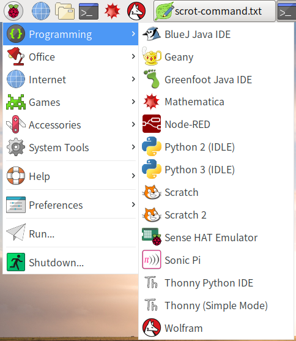

# IDE
[Comparison of integrated development environments § Python](https://en.wikipedia.org/wiki/Comparison_of_integrated_development_environments#Python)

raspbian 默认安装了 [IDLE](https://en.wikipedia.org/wiki/IDLE_(Python))、[Geany](https://en.wikipedia.org/wiki/Geany) 和 [Thonny](https://en.wikipedia.org/wiki/Thonny) 等 python 集成编译工具。



## [IDLE](https://docs.python.org/3/library/idle.html)
**IDLE** (**I**ntegrated **D**eveLopment **E**nvironment or **I**ntegrated **D**evelopment and **L**earning **E**nvironment) is an integrated development environment for Python, which has been bundled with the default implementation of the language since 1.5.2b1.  
It is packaged as an optional part of the Python packaging with many Linux distributions.  

IDLE is intended to be a *simple* IDE and suitable for beginners, especially in an educational environment. To that end, it is cross-platform, and avoids feature clutter.

## [Geany](http://www.geany.org/)

在 raspbian 终端输入 `geany -V` 查看 geany 版本信息：

```Shell
pi@raspberrypi:~ $ geany -V
geany 1.29 (built on 2017-10-30 with GTK 2.24.31, GLib 2.50.3)
```

在 raspbian 终端输入 `man geany` 查看 geany 帮助信息：

```Shell
GEANY(1)                                                                             GEANY(1)

NAME
       Geany — a small and lightweight IDE

SYNOPSIS
       geany [option]  [+number]  [files ...]

DESCRIPTION
       Geany  is  a  small  and  fast editor with basic features of an integrated development
       environment.

       Some of its features: syntax highlighting, code completion, code  folding,  symbol/tag
       lists  and  many  supported  filetypes  like C(++), Java, PHP, HTML, DocBook, Perl and
       more.

       Homepage: http://www.geany.org/
```

## [thonny](http://thonny.org)
Python IDE for beginners：[thonny](http://thonny.org)  

在终端输入 `pip3 show thonny` 可查看 thonny 信息：

```Shell
pi@raspberrypi:~ $ pip3 show thonny
Name: thonny
Version: 2.1.10
Summary: Python IDE for beginners
Home-page: http://thonny.org
Author: Aivar Annamaa and others
Author-email: thonny@googlegroups.com
License: MIT
Location: /usr/lib/python3/dist-packages
Requires: 
```

## [pycharm](https://www.jetbrains.com/pycharm/)
[download](https://www.jetbrains.com/pycharm/download/) Python IDE for Professional Developers

[PyCharm](https://zh.wikipedia.org/wiki/PyCharm) 是一个用于计算机编程的集成开发环境（IDE），主要用于Python语言开发，由捷克公司JetBrains开发。  
PyCharm 提供代码分析、图形化调试器，集成测试器、集成版本控制系统（Vcs），并支持使用Django进行网页开发。  
PyCharm一个跨平台开发环境，拥有Windows, macOS 和Linux版本。社区版在Apache许可证下发布，另外还有专业版在专用许可证下发布，其拥有许多额外功能。

> [pycharm 教程（一）安装和首次使用](http://blog.csdn.net/chenggong2dm/article/details/9365437)  
> [你有哪些想要分享的 PyCharm 使用技巧？](https://www.zhihu.com/question/37787004)  
> [Install PyCharm and Anaconda (Windows /Mac/Ubuntu)](https://medium.com/@GalarnykMichael/setting-up-pycharm-with-anaconda-plus-installing-packages-windows-mac-db2b158bd8c)  
> [How To Install The PyCharm Python IDE In Linux](https://www.lifewire.com/how-to-install-the-pycharm-python-ide-in-linux-4091033)  

## Sublime Text 3
> [怎么用sublime text 3搭建python 的ide？](https://www.zhihu.com/question/22904994)  
> [sublime text 3 打造成python IDE 环境](http://www.jianshu.com/p/a401a0bfddf7)  
> [将 Sublime 3 打造成 Python/Django IDE](http://www.weiguda.com/blog/48/)  
> [将Sublime Text 3设置为Python全栈开发环境](http://python.jobbole.com/81312/) - macOS  
> [sublime text 3 + python配置，完整搭建及常用插件安装](http://blog.csdn.net/mx472756841/article/details/50535517) - windows  

### SublimeREPL

### Anaconda
Anaconda 是一个终极 Python 插件，它为 ST3 增添了多项 IDE 类似的功能特性。

Anaconda 是目前 Sublime 3 中最好的 Python 自动补全和语法提示插件，并且提供了"跳转到定义"、"查找使用"、"显示文档"、"自动重命名" 等 IDE 中插件的功能。

### Djaneiro
Djaneiro 支持 Django 模版和关键字高亮以及许多实用的代码片(snippets)功能。其中的 snippets 绝对是省时神器。你可以通过很少几个关键字就能创建许多常见的 Django 代码块比如 templates，models，forms，以及 views。

### SublimeLinter
SublimeLinter 是 ST3 的一个代码静态检查工具框架(linter)。

这个插件本身来说并不包含任何的一个 linter，但是你可以通过在 Package Control 中输入 SublimeLinter-[linter_name] 的方式来安装一个 linter。

对于 Python 的代码静态检查器，我建议使用 `SublimeLinter-pyflakes` 和 `SublimeLinter-pep8`。

### Jedi

### AutoPep8
