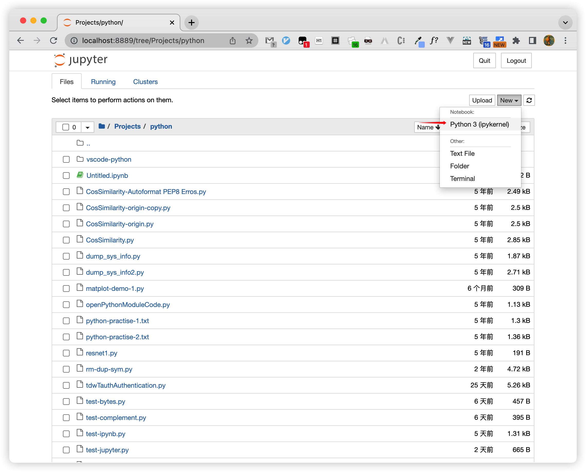
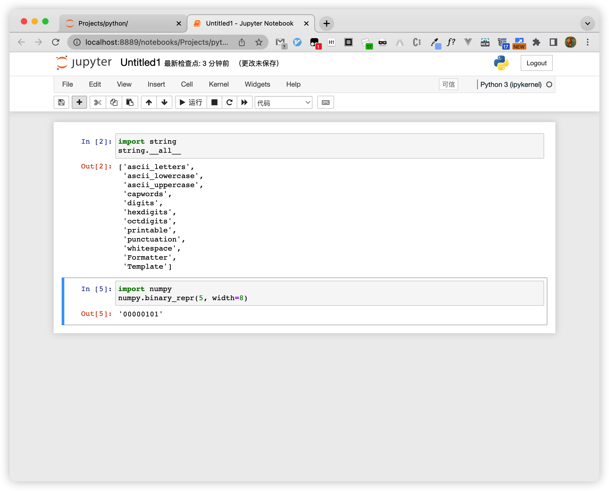

## Jupyter Notebook

`Jupyter Notebook`: The Classic Notebook Interface

> The Jupyter Notebook is the original web application for creating and sharing computational documents. It offers a simple, streamlined, document-centric experience.

[Python的做笔记神器](https://blog.csdn.net/weixin_38168620/article/details/79576970)

Jupyter Notebook 相当于在浏览器中完成python编程任务，不仅可以写代码、做笔记，而且还可以得到每一步的执行结果，效果非常好。

自从Jupyter Notebook 1.0发布以来，越来越多科学家、研究者、教师使用IPython Notebook处理数据、写研究报告、甚至编写书籍。

推荐使用 Anaconda，自带了 Numpy、Scipy、Matplotlib 等多种 python 开发包和 Jupyter Notebook！

[jupyter notebook安装与配置](https://blog.51cto.com/huangyg/2315382?cid=728374)  
[Python Jupyter Notebook各种使用方法记录](https://blog.csdn.net/qq_25148881/article/details/83004238)  
[python环境搭建以及jupyter notebook的安装和启动](https://www.cnblogs.com/jiangfengtomhuo/p/7987419.html)  

### launch

在 Anaconda Navigator 中点击启动 Jupyter Notebook 会开一个终端Terminal并启动 python webServer。

```Shell
$ /usr/local/anaconda3/bin/jupyter_mac.command ; exit;
[I 2022-06-03 10:17:13.200 LabApp] JupyterLab extension loaded from /usr/local/anaconda3/lib/python3.9/site-packages/jupyterlab
[I 2022-06-03 10:17:13.200 LabApp] JupyterLab application directory is /usr/local/anaconda3/share/jupyter/lab
[I 10:17:13.206 NotebookApp] Serving notebooks from local directory: /Users/faner
[I 10:17:13.206 NotebookApp] Jupyter Notebook 6.4.5 is running at:
[I 10:17:13.206 NotebookApp] http://localhost:8888/?token=b4f7fcc120abf0c978c105a14aa675b4f9326000da7519f4
[I 10:17:13.206 NotebookApp]  or http://127.0.0.1:8888/?token=b4f7fcc120abf0c978c105a14aa675b4f9326000da7519f4
[I 10:17:13.207 NotebookApp] Use Control-C to stop this server and shut down all kernels (twice to skip confirmation).
[C 10:17:13.220 NotebookApp] 
```

将会在默认浏览器中打开 http://localhost:8890/tree 。

### usage

New | Notebook - Python 3 (ipykernel)，将新建一个 Notebook Tab页面：



在打开的 Jupyter Notebook 中的单元格中输入 Python 代码，按下 control+command（^⌘）快捷键即可执行：



> 按下组合键 shift+command（⇧⌘）将在执行当前单元格后，在下面新开一个Cell并聚焦输入。

点击 `➕` 可在下面插入新单元格。

### nbextensions

[jupyter notebook中设置代码的自动补全功能](https://blog.csdn.net/qq_45154565/article/details/109113838)

```Shell
# 安装对应所需模块
pip install jupyter_contrib_nbextensions

# 启用用户配置
jupyter contrib nbextension install --user
```

[JupyterNotebook代码提示与自动补齐](https://blog.csdn.net/maoyuanming0806/article/details/109744284)

```Shell
pip install jupyter_contrib_nbextensions
jupyter contrib nbextension install --user

pip install jupyter_nbextensions_configurator
jupyter nbextensions_configurator enable --user
```

配置之后重启jupyter，后面多出来一项菜单 `Nbextensions`，点开勾选上 Codefolding（折叠代码块）和 Hinterland（代码自动补全）即可。

### import

当有多个Cell时，由于每个Cell都是可以独立执行，可能会import导入重复的模块。

可考虑将第一个 Cell 专用作 import Cell，后面其他 Cell 所需的模块都集中在此 import。
每当导入了新模块后，运行使得导入生效，后续就无需重复导入了。

- [Importing Jupyter Notebooks as Modules](https://jupyter-notebook.readthedocs.io/en/stable/examples/Notebook/Importing%20Notebooks.html)

## JetBrains Datalore

在 Anaconda-Navigator 启动面板中，除了 Jupyter Notebook 和 JupyterLab，还可使用 JetBrains 的 Datalore。

https://www.anaconda.com/datalore_navigator 重定向到 https://www.jetbrains.com/datalore/

个人用户点击【Start for free】->【For Yourself】->【Community Plan】，然后使用Google账号登录即可。

Datalore 相较 Jupyter Notebook 和 JupyterLab，自带的代码提示比较强大！

[How to Get the Best Autocomplete in Jupyter Notebooks and More](https://blog.jetbrains.com/datalore/2022/07/14/how-to-get-the-best-autocomplete-in-jupyter-notebooks-and-more/)

## Notebook vs. Lab

[Jupyter notebook 和 Jupyter lab 的区别](https://www.cnblogs.com/heenhui2016/p/10637746.html)  
[Jupyter Lab对比Jupyter Notebook有什么优点和不足？](https://www.zhihu.com/question/413049489)  
[What is the difference between Jupyter Notebook and JupyterLab?](https://stackoverflow.com/questions/50982686/what-is-the-difference-between-jupyter-notebook-and-jupyterlab)  

Jupyter Notebook 是一个款以网页为基础的交互计算环境，可以创建Jupyter的文档，支持多种语言，包括Python, Julia, R等等。广泛用于数据分析，数据可视化和其他的交互和探索性计算中。

JupyterLab 是包括了Notebook的下一代用户界面。有模块化的界面，可以在同一个窗口同时打开好几个notebook或文件（HTML, TXT, Markdown等等），都以标签的形式展示，于是就更像是一个IDE。

