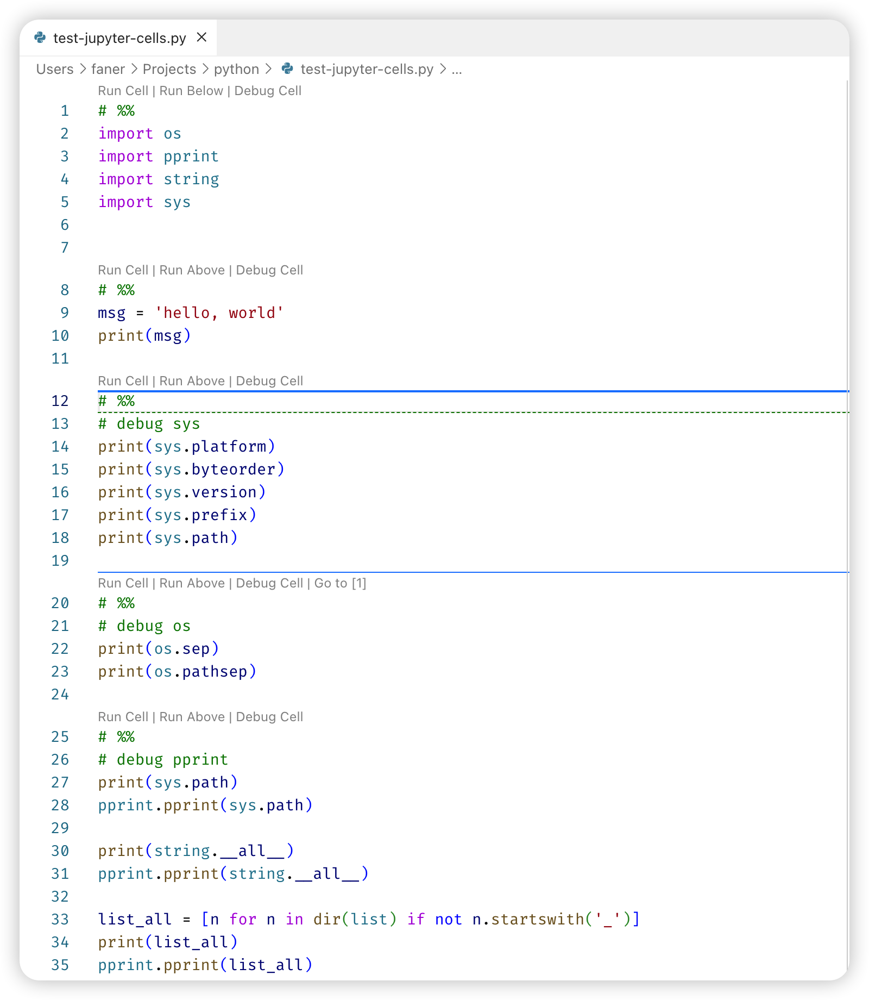

## vscode Jupyter

[Jupyter Notebooks in VS Code](https://code.visualstudio.com/docs/python/jupyter-support)

- [在VS Code中使用Jupyter Notebooks](https://blog.csdn.net/acktomas/article/details/119616895)

[Jupyter](https://jupyter.org/install) 插件已经 Deprecated，只需要安装 [Microsoft Python](https://marketplace.visualstudio.com/items?itemName=ms-python.python) 插件即可，微软官方提供了 Python 插件已经内嵌打包了 Jupyter 插件（可通过 Extension Pack 查看）。

1. `Python`: IntelliSense (Pylance), Linting, Debugging (multi-threaded, remote), Jupyter Notebooks, code formatting, refactoring, unit tests, and more.

    - Extension Pack: `Pylance`, `Jupyter` and `isort`.

2. `Jupyter`: Jupyter notebook support, interactive programming and computing that supports Intellisense, debugging and more.

    - Extension Pack: `Jupyter Keymap`, `Jupyter Notebook Renderers`, `Jupyter Slide Show`, `Jupyter Cell Tags`.

### Jupyter Cell

[VSCode 编写 Python 支持 Jupyter notebook 了](https://blog.csdn.net/qq_20084101/article/details/84146676)  

Jupyter notebook是逐个cell依次执行，那在VS Code要怎么做到这点呢？

在 vscode 控制面板中，点选 `Jupyter: Add Empty Cell to File`，将会在光标处插入 `# %%`。

在 vscode 中创建文本文件，将 Language Mode 设定为 Python，以 `#%%` 开头即会被识别为一个 Jupyter Cell，方便快捷调试。  

```Python
#%%
msg = 'hello, world'
print(msg)
```



### Jupyter Notebook

[如何在vscode中使用Jupyter Notebook](https://cangmang.xyz/articles/1642849032438)
[VSCode 中 Jupyter Notebook 互动编程](https://pythonviz.com/colab-jupyter/visual-studio-code-jupyter-notebook-integration/)

在 vscode 控制面板中，点选 `Create: New Jupyter Notebook` 则会创建一个新的 Notebook（Untitled-1.ipynb）。

> ipynb 为 IPython Note Book 后缀。

vscode 也支持直接打开 Notebook 文件（*.ipynb），进行编辑运行。

**代码单元格模式**：

在处理代码单元时，单元格可以处于三种状态：未选定、命令模式和编辑模式。单元格的当前状态由代码单元和编辑器边框左侧的垂直条表示。
当看不到左侧垂直条和聚焦边框时，单元格是未选定状态。

**添加其他代码单元格**：

支持 + Code、+ Markdown 创建代码或Markdown Cell，方便写代码兼做笔记。

**InterelliSense**：

vscode 中编辑 Jupyter Notebooks，提供完整的 InterelliSense 支持，包括代码自动完成、成员列表、方法的快速信息和参数提示。
在 Notebooks 编辑器窗口中，您可以与在代码编辑器中一样高效地输入书写Python代码。

### import

当有多个Cell时，由于每个Cell都是可以独立执行，可能会import导入重复的模块。

可考虑将第一个 Cell 专用作 import Cell，后面其他 Cell 所需的模块都集中在此 import。
每当导入了新模块后，运行使得导入生效，后续就无需重复导入了。

- [Importing Jupyter Notebooks as Modules](https://jupyter-notebook.readthedocs.io/en/stable/examples/Notebook/Importing%20Notebooks.html)


