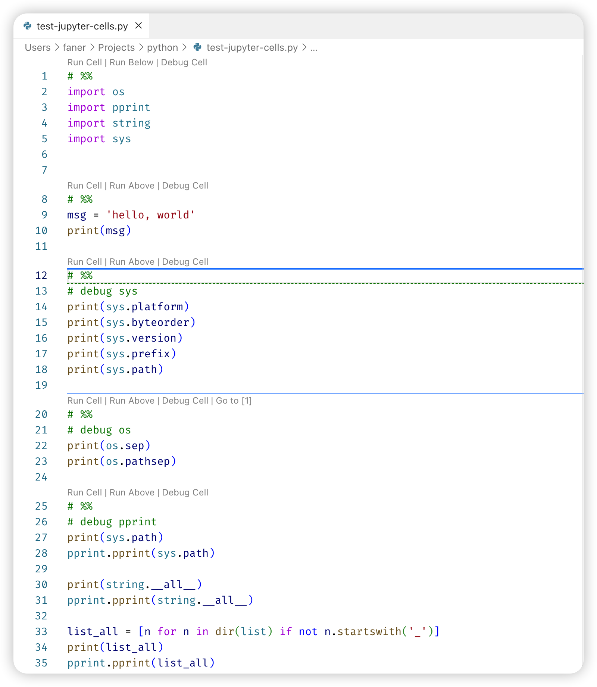
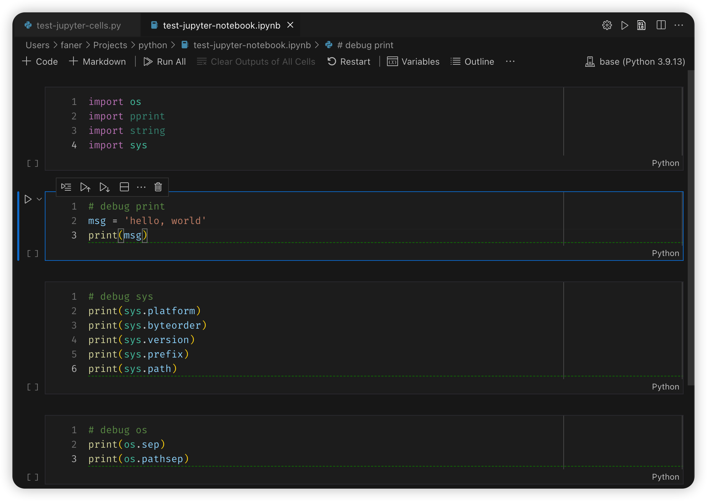

[TOC]

## vscode Jupyter

[Jupyter Notebooks in VS Code](https://code.visualstudio.com/docs/datascience/jupyter-notebooks)

- Setting up your environment
- Workspace Trust
- Create or open a Jupyter Notebook
- Running cells
- Save your Jupyter Notebook
- Export your Jupyter Notebook
- Work with code cells in the Notebook Editor
- Table of Contents
- IntelliSense support in the Jupyter Notebook Editor
- Variable Explorer and Data Viewer
- Saving plots
- Custom notebook diffing
- Debug a Jupyter Notebook
- Connect to a remote Jupyter server
- Data Science profile template

[Python Interactive](https://code.visualstudio.com/docs/python/jupyter-support-py)

- Jupyter code cells
- Using the Python Interactive window
- Variables Explorer and Data Viewer
- Connect to a remote Jupyter server
- Convert Jupyter notebooks to Python code file
- Debug a Jupyter notebook
- Export a Jupyter notebook

[在VS Code中使用Jupyter Notebooks](https://blog.csdn.net/acktomas/article/details/119616895)

[Jupyter](https://jupyter.org/install) 插件已经 Deprecated，只需要安装 [Microsoft Python](https://marketplace.visualstudio.com/items?itemName=ms-python.python) 插件即可，微软官方提供了 Python 插件已经内嵌打包了 Jupyter 插件（可通过 Extension Pack 查看）。

1. `Python`: IntelliSense (Pylance), Linting, Debugging (multi-threaded, remote), Jupyter Notebooks, code formatting, refactoring, unit tests, and more.

    - Extension Pack: `Pylance`, `Jupyter` and `isort`.

2. `Jupyter`: Jupyter notebook support, interactive programming and computing that supports Intellisense, debugging and more.

    - Extension Pack: `Jupyter Keymap`, `Jupyter Notebook Renderers`, `Jupyter Slide Show`, `Jupyter Cell Tags`.

在 Command Palette 中输入 `Jupyter: ` 可查看相关命令。

### Jupyter Code Cells

Python Interactive - [Jupyter code cells](https://code.visualstudio.com/docs/python/jupyter-support-py#_jupyter-code-cells)

- You define Jupyter-like code cells within Python code using a `# %%` comment.

[VSCode 编写 Python 支持 Jupyter notebook 了](https://blog.csdn.net/qq_20084101/article/details/84146676)  

Jupyter notebook是逐个cell依次执行，那在VS Code要怎么做到这点呢？

在 vscode 控制面板中，点选 `Jupyter: Add Empty Cell to File`，将会在光标处插入 `# %%`。

在 vscode 中创建文本文件，将 Language Mode 设定为 Python，以 `#%%` 开头即会被识别为一个 Jupyter Cell，方便快捷调试。  

```Python
#%%
msg = 'hello, world'
print(msg)
```



### Jupyter Notebook

[如何在vscode中使用Jupyter Notebook](https://cangmang.xyz/articles/1642849032438)
[VSCode 中 Jupyter Notebook 互动编程](https://pythonviz.com/colab-jupyter/visual-studio-code-jupyter-notebook-integration/)

Jupyter Notebooks - [Create or open a Jupyter Notebook](https://code.visualstudio.com/docs/datascience/jupyter-notebooks#_create-or-open-a-jupyter-notebook)

在 vscode 控制面板中，点选 `Create: New Jupyter Notebook` 则会创建一个新的 Notebook（Untitled-1.ipynb）。

> ipynb 为 IPython Note Book 后缀。

vscode 也支持直接打开 Notebook 文件（*.ipynb），进行编辑运行。

Jupyter Notebooks - [Work with code cells in the Notebook Editor](https://code.visualstudio.com/docs/datascience/jupyter-notebooks#_work-with-code-cells-in-the-notebook-editor)

**代码单元格模式**：

在处理代码单元时，单元格可以处于三种状态：未选定、命令模式和编辑模式。单元格的当前状态由代码单元和编辑器边框左侧的垂直条表示。
当看不到左侧垂直条和聚焦边框时，单元格是未选定状态。

**添加其他代码单元格**：

支持 + Code、+ Markdown 创建代码或Markdown Cell，方便写代码兼做笔记。

**InterelliSense**：

Jupyter Notebooks - [IntelliSense support in the Jupyter Notebook Editor](https://code.visualstudio.com/docs/datascience/jupyter-notebooks#_intellisense-support-in-the-jupyter-notebook-editor)

vscode 中编辑 Jupyter Notebooks，提供完整的 InterelliSense 支持，包括代码自动完成、成员列表、方法的快速信息和参数提示。
在 Notebooks 编辑器窗口中，您可以与在代码编辑器中一样高效地输入书写Python代码。

## Run & Debug Cell

Jupyter Notebooks - [Running cells](https://code.visualstudio.com/docs/datascience/jupyter-notebooks#_running-cells)

- Execute Cell: `⌃Enter`
- Debug Cell: `⌃⇧Enter`

### requires ipykernel package

在 Notebook 的右上角选择 Kernel 为最新 brew 更新的 python3.12，提示 requires the ipykernel package：

```Shell
Running cells with '/usr/local/bin/python3.12' requires the ipykernel package.  
Run the following command to install 'ipykernel' into the Python environment.   
Command: '/usr/local/bin/python3.12 -m pip install ipykernel -U --user --force-reinstall'
```

具体参考 [Jupyter Kernels and the Jupyter Extension · microsoft/vscode-jupyter Wiki](https://github.com/microsoft/vscode-jupyter/wiki/Jupyter-Kernels-and-the-Jupyter-Extension#python-extension-and-ipykernel)。

ipykernel 是 IPython Kernel for Jupyter，brew 更新安装最新的 python3.12 默认没有安装，需要自行安装。
可执行 `pip3 show ipykernel | 核实是否安装，在 conda base | 核实有安装：

```Shell
# macOS 没有安装
$ pip3 show ipykernel
WARNING: Package(s) not found: ipykernel

# conda base 中有安装
$ conda list | grep ipy

$ conda activate base
$ pip3 show ipykernel
Name: ipykernel
Version: 6.28.0
Summary: IPython Kernel for Jupyter

Location: /usr/local/anaconda3/lib/python3.9/site-packages
```

由于anaconda的科学计算工具包比较齐全，可考虑直接使用 conda base kernel 用于 vscode Notebook 调试。

如果想体验 macOS brew 升级的最新 python3.12 的某些新功能特性，可以自行使用 pip3 安装 ipykernel。

参考：

[Vscode jupyter notebook requires ipykernel : r/learnpython](https://www.reddit.com/r/learnpython/comments/11hdcox/vscode_jupyter_notebook_requires_ipykernel/)

Make sure to install the Jupyter extension, first.
Then Press Command+Shift+P to open a new command pallete,
Type >Python: Select Intepreter to start jupyter notebook server

[ipykernel not detected ('Running cells with 3.9.13 (base) requires ipykernel package installed or requires an update') · Issue #20306 · microsoft/vscode-python](https://github.com/microsoft/vscode-python/issues/20306)

[visual studio code - Python requires ipykernel to be installed - Stack Overflow](https://stackoverflow.com/questions/64997553/python-requires-ipykernel-to-be-installed)

### import/run across cells

当有多个Cell时，由于每个Cell都是可以独立执行，可能会import导入重复的模块。

可考虑将第一个 Cell 专用作 import Cell，后面其他 Cell 所需的模块都集中在此 import。
每当第一个 Cell 导入了新模块后，重新运行该 Cell 导入更新生效，后续就无需重复导入了。

- [Importing Jupyter Notebooks as Modules](https://jupyter-notebook.readthedocs.io/en/stable/examples/Notebook/Importing%20Notebooks.html)

运行过的Cell代码，已经导入到同一上下文中，因此可以执行跨Cell相互调用（类/函数），或在一个Cell中为其他Cell编写单元测试。



### Debug Cell

- [How notebook debug cell works · microsoft/vscode-jupyter Wiki](https://github.com/microsoft/vscode-jupyter/wiki/How-notebook-debug-cell-works)
- [Jupyter Notebooks in VS Code](https://code.visualstudio.com/docs/datascience/jupyter-notebooks) - Debug a Jupyter Notebook
- [Python Interactive](https://code.visualstudio.com/docs/python/jupyter-support-py) - Debug a Jupyter notebook

There are two different ways to debug a Jupyter notebook: 

- a simpler mode called `Run by Line`, first button in the cell toolbar;
- full debugging mode - `Debug Cell` adornment that appears above the cell.

If you want to use the full set of debugging features supported in VS Code, such as breakpoints and the ability to step in to other cells and modules, you can use the *full* VS Code debugger.

1. Start by setting any **breakpoints** you need by clicking in the left margin of a notebook cell.
2. Then select the `Debug Cell` button in the menu next to the Run button. This will run the cell in a debug session, and will pause on your breakpoints in any code that runs, even if it is in a *different* cell or a `.py` file.
3. You can use the Debug view, Debug Console, and all the buttons in the Debug Toolbar as you normally would in VS Code.

可执行跨Cell调用断点调试。

## notebook diffing

[Viewing Ipython Notebooks' line based diff in VS Code while using the Python extension - Stack Overflow](https://stackoverflow.com/questions/67220559/viewing-ipython-notebooks-line-based-diff-in-vs-code-while-using-the-python-ext)
[SOLVED - Have vscode-jupyter do proper diffing in Git · microsoft/vscode-jupyter · Discussion #10742](https://github.com/microsoft/vscode-jupyter/discussions/10742)

vscode 中 Jupyter Notebook 文件 *.ipynb 有改动时，在左侧 SOURCE CONTROL 中 git changes 双击打开 diff，可能无法展示改动点。

[Custom notebook diffing](https://code.visualstudio.com/docs/datascience/jupyter-notebooks#_custom-notebook-diffing)

1. 更多里勾选 Show Metadata Differences，不勾选 Show Output Differences，勾选 Show Moved Code Blocks。
2. 如果还是不显示diff，点击右上角工具条的 Open Text Diff Editor 直接比较文本内容。
3. 可点击右上角工具条的 Toggle Collapse Unchanged Regions，隐藏未变动的部分。

## conversion

Jupyter Notebooks - [Export your Jupyter Notebook](https://code.visualstudio.com/docs/datascience/jupyter-notebooks#_export-your-jupyter-notebook)

- You can export a Jupyter Notebook as a Python file (`.py`), a PDF, or an HTML file. To export, select the Export action on the main toolbar.

Python Interactive - [Convert Jupyter notebooks to Python code file](https://code.visualstudio.com/docs/python/jupyter-support-py#_convert-jupyter-notebooks-to-python-code-file): 

- The notebook's cells are delimited in the Python file with `# %%` comments;
- Markdown cells are converted wholly to comments preceded with `# %% [markdown]`

Python Interactive - [Export a Jupyter notebook](https://code.visualstudio.com/docs/python/jupyter-support-py#_export-a-jupyter-notebook): Convert a Python file to a Jupyter notebook

- to export content from a Python file in VS Code to a Jupyter notebook
- using the `# %%` and `# %% [markdown]` delimiters to specify their respective cell types.

## unittest

[Unit tests - Jupyter Tutorial 1.1.0](https://jupyter-tutorial.readthedocs.io/en/stable/notebook/testing/unittest.html)

- [How to do unit test inside jupyternotebook | by Stan | Medium](https://medium.com/@Stan_DS/how-to-do-unit-test-inside-jupyternotebook-c49191908a85)
- [python - Unit tests for functions in a Jupyter notebook? - Stack Overflow](https://stackoverflow.com/questions/40172281/unit-tests-for-functions-in-a-jupyter-notebook)

假设Cell 1中定义了一个函数Cell：

```Python
def add(a, b):
    return a + b
```

可以在Cell 2中编写测试Cell 1中add函数的单测用例：

- 运行Cell2之前，必须先运行Cell1使之加载。

```Python
import unittest

class TestNotebook(unittest.TestCase):

    def test_add(self):
        self.assertEqual(add(2, 3), 5)


unittest.main(argv=[''], verbosity=2, exit=False)
```

除了使用常规的 Python 单元测试框架 unittest，还可使用 [ipython-unittest](https://github.com/JoaoFelipe/ipython-unittest)。

After install(pip3 install ipython-unittest), please run `%load_ext ipython_unittest` in Cell to load the extension.

ipython-unittest enables the following *Cell Magics* to be used in iPython:

- `%%unittest_main`: executes test cases that are defined in a cell
- `%%unittest_testcase`: creates a test case with the function defined in a cell and executes it
- `%%unittestconverts`: Python assert to unit test functions
- `%%external`: to perform external unit tests
- `%%write`: {mode} to write external files

为兼容期间，建议使用 Python 标准的单元测试框架 unittest。
