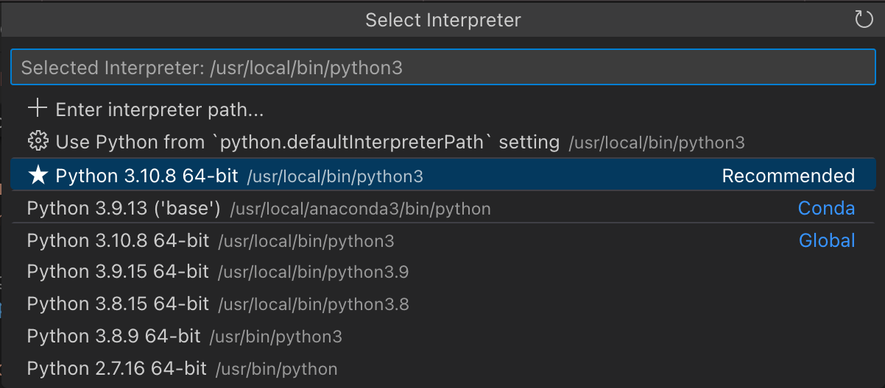

[TOC]

[Python in VS Code](https://code.visualstudio.com/docs/python/)

- Tutorial - [Getting Started with Python in VS Code](https://code.visualstudio.com/docs/python/python-tutorial)  
- Environments - [Using Python environments in VS Code](https://code.visualstudio.com/docs/python/environments)  

[Python in Visual Studio Code](https://code.visualstudio.com/docs/languages/python)

* [Editing Code](https://code.visualstudio.com/docs/python/editing)  
* [Linting](https://code.visualstudio.com/docs/python/linting)  
* [Debugging](https://code.visualstudio.com/docs/python/debugging)  

## vscode + python

[vscode-python](https://github.com/fan2/Text-Reader-Editor/blob/master/vscode/vscode-python.md)

微软官方提供了 Python 插件（内嵌 Jupyter 插件）：

1. `Python`: IntelliSense (Pylance), Linting, Debugging (multi-threaded, remote), Jupyter Notebooks, code formatting, refactoring, unit tests, and more.

    - Extension Pack: `Pylance`, `Jupyter` and `isort`.

2. `Jupyter`: Jupyter notebook support, interactive programming and computing that supports Intellisense, debugging and more.

    - Extension Pack: `Jupyter Keymap`, `Jupyter Notebook Renderers`, `Jupyter Slide Show`, `Jupyter Cell Tags`.

[vscode上配置python的运行环境](https://www.cnblogs.com/EtoDemerzel/p/8083313.html)  
[那些使用VSCode写Python踩过的坑(Anaconda配置)](https://blog.csdn.net/weixin_30784501/article/details/95107106)  

### interpreter

[Select a Python interpreter](https://code.visualstudio.com/docs/python/python-tutorial#_select-a-python-interpreter)



1. `Recommended` 为 vscode settings 中配置的 defaultInterpreterPath。
2. 当在 vscode settings 中配置了 CondaPath，会在此处出现 `Conda` 子环境的解释器版本。
3. `Global` 为 homebrew 安装（/usr/local/bin/python3）和 macOS 自带的（usr/bin/python3）。

> Global 下可能出现 brew 安装的多个版本供选择。

### run debug

vscode 打开普通 Python File（例如code.py），可以有以下运行方式：

1. `⇧⌘P` 调起 Command Palette，输入 `Run`，可执行 Run Code 或 Python: Run Python File in Terminal。

    - 如果py脚本开头没有指定 Shebang - `#!/usr/bin/env python3`，则执行 `/usr/bin/env python3 code.py`；否则，将执行 `python -u code.py`。

2. 可在右上角 ▶︎ 按钮下拉选择运行方式：Run Python File, Run Python File in Dedicated Terminal 将采用 Python: Select Interpreter 中选定的python版本执行脚本。

    - 例如：`/usr/local/bin/python3.9 code.py`

调试（Debug）也可从多个入口发起：

1. `⇧⌘P` 调起 Command Palette，输入 `Debug`，选择 Debug: Start Debugging 选择 Python Debugger。
2. 可在右上角 ▶︎ 按钮下拉选择 `Python Debugger: Debug Python File` 启动调试。
3. 在左侧浏览器面板中点击 Run and Debug，也起发起调试。

## vscode + conda

Anaconda 配合 VSCode 可以搭建一个适用于机器学习、AI、数据科学领域学习与开发的 Python 开发环境。

### condaPath

```
  // Path to the conda executable to use for activation (version 4.4+).
  "python.condaPath": "/usr/local/anaconda3/condabin/conda",
```

[Remove python.condaPath from workspace scope #17819](https://github.com/microsoft/vscode-python/issues/17819)
[python.condaPath not considered when calling conda #9154](https://github.com/microsoft/vscode-python/issues/9154)

配置了 `python.condaPath` 之后，运行命令 Python: Select Interpreter 下拉列表中将会显示 conda base 环境的 python。

### pythonPath

[Activating Anaconda Environment in VsCode](https://stackoverflow.com/questions/43351596/activating-anaconda-environment-in-vscode)

快捷键 `cmd+,` 打开 vscode 偏好设置，编辑修改（`~/Library/Application Support/Code/User/settings.json`），找到如下两个参数：

1. python.pythonPath（现已变更为 `defaultInterpreterPath`）；  
2. python.autoComplete.extraPaths；  

修改为 conda 子环境下对应的 bin/python 和 side-packages：

> [Finding your Anaconda Python interpreter path](https://docs.anaconda.com/anaconda/user-guide/tasks/integration/python-path/)

```
# 设置 base 环境
    "python.defaultInterpreterPath": "/usr/local/anaconda3/bin/python3",
    "python.autoComplete.extraPaths": ["/usr/local/anaconda3/lib/python3.9/site-packages"],
```

```
# 设置 Py376 环境
    "python.defaultInterpreterPath": "/usr/local/anaconda3/envs/Py376/bin/python3",
    "python.autoComplete.extraPaths": ["/usr/local/anaconda3/envs/Py376/lib/python3.7/site-packages"],
```

### refs

[搭建 Python 轻量级编写环境（Anaconda+VSCode）](https://zhuanlan.zhihu.com/p/147336202)  
[Working with Anaconda in Visual Studio Code](https://stackoverflow.com/questions/54828713/working-with-anaconda-in-visual-studio-code)  

[Anaconda+VSCode搭建python环境](https://www.jianshu.com/p/f10fb1a4cc87) - Windows  
[Anaconda＋VSCode搭建python开发环境](https://cloud.tencent.com/developer/news/313349) - Windows  
[windows10环境下用anaconda和VScode配置](https://blog.csdn.net/u011622208/article/details/79625908)  

[MacOS下如何配置Vscode+Anaconda呢？](https://www.zhihu.com/question/265853927)  
[mac vscode配置 anaconda 虚拟环境](https://blog.csdn.net/liubingjun07/article/details/88833885)  
[Mac+Anaconda+PyCharm+VSCode环境搭建](https://blog.csdn.net/qq_28863845/article/details/82589857)  

## python debug

在 vscode 中打开 Python 脚本文件(test.py)，在文本编辑区左侧 gutter 上点击下断点。
然后在右上角 ▶︎ 按钮，下拉选择 `Python Debugger: Debug Python File`，即可启动调试。
启动调试运行起来后，命中断点中断，右侧会有一个悬浮的调试工具条，支持 Continue、Step Over/Into/Out。
同时，左侧侧边拉会打开 Run and Debug，其中可以查看 Variables（Locals, Globals）、Watch 和 CallStack。

参考：

- Quick Start - [UI tour](https://code.visualstudio.com/docs/python/python-quick-start#_ui-tour)。
- Quick Start - [Run, debug, and test](https://code.visualstudio.com/docs/python/python-quick-start#_run-debug-and-test)
