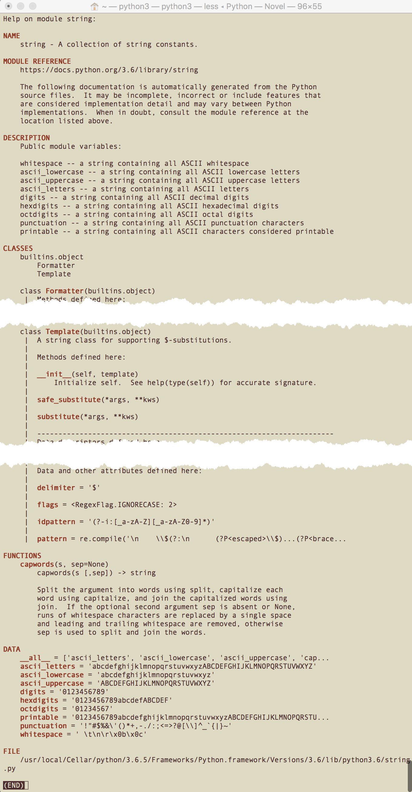

## Docs

[Documentation](https://www.python.org/doc/) » [Python 3.x Docs](http://docs.python.org/3/)  

[Glossary](https://docs.python.org/3/glossary.html)  

[Language Reference](https://docs.python.org/3/reference/index.html)  
[Library Reference](https://docs.python.org/3/library/index.html)  
[Tutorial](https://docs.python.org/3.6/tutorial/)  
[Python HOWTOs](https://docs.python.org/3/howto/index.html)  

[Python Developer’s Guide](https://devguide.python.org/)  

[查看python的模块和函数帮助文档方法](http://blog.csdn.net/u013810296/article/details/55509284)  

## help

[help](https://docs.python.org/3/library/functions.html#help)

```Shell
>>> help
Type help() for interactive help, or help(object) for help about object.
```

Invoke the built-in help system. (This function is intended for interactive use.) 

- If no argument is given, the **interactive help system** starts on the interpreter console.  
- If the argument is a string, then the string is looked up as the name of a module, function, class, method, keyword, or documentation topic, and a help page is printed on the console.  
- If the argument is any other kind of object, a help page on the object is generated.  

### help(object)

调用 `help('modules')` 可以列出当前所有已安装的模块：

```Shell
>>> help(modules)
Traceback (most recent call last):
  File "<stdin>", line 1, in <module>
NameError: name 'modules' is not defined

>>> help('modules')

Please wait a moment while I gather a list of all available modules...

```

在 REPL 中输入 `import module` 导入模块 module 后，可调用 `help(module)` 查看模块帮助：

1. 调用  `help(module.function)` 查看 module 的静态函数 function 的帮助。  
2. 调用  `help(module.class)` 查看 module 的类 class 帮助。  
3. 调用  `help(module.class.method)` 查看 module 的类 class 成员函数 function 帮助。  

对于内置的 builtins 模块，以上三步可省掉 module 前缀：

```Shell
# 查看 builtins 内建的 print 函数帮助
>>> help(print)

Help on built-in function print in module builtins:

# 查看 builtins 内建的 len 函数帮助
>>> help(len)

Help on built-in function len in module builtins:

len(obj, /)
    Return the number of items in a container.

# 查看 builtins 内建的 str 类帮助
>>> help(str)

Help on class str in module builtins:

# 查看 builtins 内建的 int 类帮助
>>> help(int)

Help on class int in module builtins:

class int(object)

# 查看 builtins 内建的 list 类帮助
>>> help(list)

Help on class list in module builtins:

class list(object)
 |  list() -> new empty list
 |  list(iterable) -> new list initialized from iterable's items
 |  

# 查看 builtins 内建的 set 类帮助
>>> help(set)

Help on class set in module builtins:

class set(object)
 |  set() -> new empty set object
 |  set(iterable) -> new set object
 |  
 |  Build an unordered collection of unique elements.

# 查看 builtins 内建的 set 类帮助
>>> help(dict)

Help on class dict in module builtins:

class dict(object)
 |  dict() -> new empty dictionary
```

#### import then help

若想调用 `help(module)` 查看 builtins 模块或其他模块帮助及说明，还得先显式 import 导入模块。

```Shell
>>> # help(builtins)
>>> help(builtins)
Traceback (most recent call last):
  File "<stdin>", line 1, in <module>
NameError: name 'builtins' is not defined
>>> # 先 import 再 help
>>> import builtins
>>> help(builtins)

Help on built-in module builtins:

NAME
    builtins - Built-in functions, exceptions, and other objects.
```

##### str

```Shell
>>> # 查看 builtins.str 类的 docstring
>>> print(str.__doc__) # help(str) 的首部概述
str(object='') -> str
str(bytes_or_buffer[, encoding[, errors]]) -> str

Create a new string object from the given object. If encoding or
errors is specified, then the object must expose a data buffer
that will be decoded using the given encoding and error handler.
Otherwise, returns the result of object.__str__() (if defined)
or repr(object).
encoding defaults to sys.getdefaultencoding().
errors defaults to 'strict'.
```

查看内置模块的 `str` 类的 startswith 函数：

```
>>> # 查看 builtins 模块的类 str 的 startswith 函数帮助
>>> help(str.startswith) #print(str.startswith.__doc__)
Help on method_descriptor:

startswith(...)
    S.startswith(prefix[, start[, end]]) -> bool

    Return True if S starts with the specified prefix, False otherwise.
    With optional start, test S beginning at that position.
    With optional end, stop comparing S at that position.
    prefix can also be a tuple of strings to try.
```

帮助文档中，str构造函数和 startswith 函数，箭头后为返回值类型。
第一个参数为必须，中括号中的参数为可选，不填时为默认值。
第1个参数必填，其他2个依次选填。

```
    str(bytes_or_buffer[, encoding[, errors]]) -> str
    S.startswith(prefix[, start[, end]]) -> bool
```

##### string

查看 `string` 模块的帮助说明：

```
>>> # help(string)
>>> help(string)
Traceback (most recent call last):
  File "<stdin>", line 1, in <module>
NameError: name 'string' is not defined
>>> # 先 import 再 help
>>>
>>> import string
>>> help(string)

Help on module string:

NAME
    string - A collection of string constants.
>>>
```



如果不 import 导入模块，加引号 `help('module')` 也可以查看模块帮助。

```Shell
>>> help('array')

Help on module array:

NAME
    array

MODULE REFERENCE
    https://docs.python.org/3.6/library/array

>>> help('collections.deque')

Help on class deque in collections:

collections.deque = class deque(builtins.object)
 |  deque([iterable[, maxlen]]) --> deque object
 |  
 |  A list-like sequence optimized for data accesses near its endpoints.
 |  
 |  Methods defined here:
```

##### pdfminer

导入查看 pdfminer 帮助，可以看到列出的模块（PACKAGE CONTENTS）：

```
>>> import pdfminer
>>> help(pdfminer)
```

如果要查看具体某个模块（例如 pdfdocument）的帮助，也需要先导入再查看：

```
>>> import pdfminer.pdfdocument
>>> help(pdfminer.pdfdocument)
```

也可通过 dir 查看其属性列表，方便略览其中定义的属性。

#### quit

> `help(object)` 以 less/vi 模式打开帮助 manual page，底行输入 `q` 即可退出返回控制台。  
> 输入 `h` 可查看 less 命令帮助；输入 `?pattern` 或 `/pattern` 可执行前向/后向搜索。  

### help()

在 python 控制台中输入 `help()` 可打开交互式（`help> prompt`）帮助系统（help utility）。

```Shell
>>> help()

Welcome to Python 3.6's help utility!

If this is your first time using Python, you should definitely check out
the tutorial on the Internet at https://docs.python.org/3.6/tutorial/.

Enter the name of any module, keyword, or topic to get help on writing
Python programs and using Python modules.  To quit this help utility and
return to the interpreter, just type "quit".

To get a list of available modules, keywords, symbols, or topics, type
"modules", "keywords", "symbols", or "topics".  Each module also comes
with a one-line summary of what it does; to list the modules whose name
or summary contain a given string such as "spam", type "modules spam".

help> 

```

从中我们可以获取到 Python 官方教程（The Python Tutorial）的网址为 <https://docs.python.org/3.6/tutorial/> 。

光标停留在 `help> ` 之后，可以输入 any module（name）、keywords 或 topics 查看模块、关键字、话题等相关帮助主题。

- `modules`：列出所有已安装模块  
- `keywords`：列出语言内置关键字  
- `symbols`：列出语言内置符号  
- `topics`：列出相关帮助主题  

#### keywords

输入 `keywords` 可以列出 Python 语言的内置关键字：

```Shell
help> keywords

Here is a list of the Python keywords.  Enter any keyword to get more help.

False               def                 if                  raise
None                del                 import              return
True                elif                in                  try
and                 else                is                  while
as                  except              lambda              with
assert              finally             nonlocal            yield
break               for                 not                 
class               from                or                  
continue            global              pass                
```

通过 `help('keyword')` 可查看某个关键字 keyword 的说明。

- 如果不清楚 python 中 `in`, `is`, `as` 关系判断的区别，可调用 help(`in`)、help(`is`) 或 help(`as`) 查看相关说明；  
- 如果不清楚关键字 `None` 和 `not` 的区别，可调用 help(`None`) 或 help(`not`) 查看相关说明；  

以下通过 `help('pass')` 获取 pass 关键字的帮助说明。

```Shell
>>> help('pass')

The "pass" statement
********************

   pass_stmt ::= "pass"

"pass" is a null operation --- when it is executed, nothing happens.
It is useful as a placeholder when a statement is required
syntactically, but no code needs to be executed, for example:

   def f(arg): pass    # a function that does nothing (yet)

   class C: pass       # a class with no methods (yet)
(END)
```

其他不熟悉或不清楚的 [nonlocal](https://docs.python.org/3.6/reference/simple_stmts.html#nonlocal), [global](https://docs.python.org/3.6/reference/simple_stmts.html#global), with 等关键字，均可通过此法获取其帮助说明。

#### symbols

输入 `symbols` 可以列出 Python 语言的内置符号：

```Shell
help> symbols

Here is a list of the punctuation symbols which Python assigns special meaning
to. Enter any symbol to get more help.

!=                  *=                  <<                  ^
"                   +                   <<=                 ^=
"""                 +=                  <=                  _
%                   ,                   <>                  __
%=                  -                   ==                  `
&                   -=                  >                   b"
&=                  .                   >=                  b'
'                   ...                 >>                  j
'''                 /                   >>=                 r"
(                   //                  @                   r'
)                   //=                 J                   |
*                   /=                  [                   |=
**                  :                   \                   ~
**=                 <                   ]                   
```

#### modules

[modules](https://docs.python.org/3.6/tutorial/modules.html)

输入 `modules` 可以列出当前所有已安装的模块：

```Shell
help> modules

Please wait a moment while I gather a list of all available modules...
```

> 等效于  `help('modules')`  

除此之外，还可以调用 `modules time` 查看所有名称或概要信息中包含 time 的模块。

```Shell
help> modules time

Here is a list of modules whose name or summary contains 'time'.
If there are any, enter a module name to get more help.

time - This module provides various functions to manipulate time values.
_strptime - Strptime-related classes and functions.
datetime - Concrete date/time and related types.
test.ann_module3 - Correct syntax for variable annotation that should fail at runtime
test.datetimetester - Test date/time type.
test.test_datetime 
test.test_strftime - Unittest for time.strftime
test.test_strptime - PyUnit testing against strptime
test.test_time 
test.test_timeit 
test.test_timeout - Unit tests for socket timeout feature.
test.time_hashlib 
timeit - Tool for measuring execution time of small code snippets.
_datetime 
pip._vendor.urllib3.util.timeout 

```

> 在处理某一特定领域问题，想要看看现有的模块库支持时，基于关键字进行模糊匹配相当实用。

#### quit

通过快捷键 `<C-c>` / `<C-d>` 或 **`quit`** 可退出 help utility 命令行 `help> `，回到 Python 主控制台 `>>> `。

```Shell
help> quit

You are now leaving help and returning to the Python interpreter.
If you want to ask for help on a particular object directly from the
interpreter, you can type "help(object)".  Executing "help('string')"
has the same effect as typing a particular string at the help> prompt.
```

`help>` 输入 `module`（无需先 import）, `module.function`, `module.class`, `module.class.method` 可查看相关帮助。

退回到 `>>>` 中输入`help(module)`、`help(module.function)`、`help(module.class)`、`help(module.class.method)` 可查看等效帮助。  

## dir() & __all__

[dir()](https://docs.python.org/3/library/functions.html#dir)

The built-in function [dir()](https://docs.python.org/3.6/tutorial/modules.html#the-dir-function) is used to find out which names a module defines. It returns a sorted list of strings:

> Note that it lists all types of names: variables, modules, functions, etc.  
> [dir()](https://docs.python.org/3.6/library/functions.html#dir) does not list the names of built-in functions and variables.  

内置模块 builtins 提供的 `dir()` 方法用于列举类或实例的属性方法。

可导入 builtins 模块，然后调用 `help(builtins.dir)` 查看帮助：

```Shell
>>> import builtins
>>> help(builtins.dir)
```

由于 builtins 模块已经内置到解释器，因此对于其中的类或函数，可省去 import，直接调用 help 或访问其 `__doc__` 查看 `dir()` 函数的说明。

```Shell
# 也可执行 print(dir.__doc__) 查看概要

>>> help(dir)

Help on built-in function dir in module builtins:

dir(...)
    dir([object]) -> list of strings
    
    If called without an argument, return the names in the current scope.
    Else, return an alphabetized list of names comprising (some of) the attributes
    of the given object, and of attributes reachable from it.
    If the object supplies a method named __dir__, it will be used; otherwise
    the default dir() logic is used and returns:
      for a module object: the module's attributes.
      for a class object:  its attributes, and recursively the attributes
        of its bases.
      for any other object: its attributes, its class's attributes, and
        recursively the attributes of its class's base classes.
```

例如执行 `dir(builtins)` 可查看模块 builtins 提供的所有属性及方法：

```Shell
>>> import builtins
>>> dir(builtins)
```

	> 也可执行 `print(builtins.__dict__)` 打印 builtins 模块的符号表。

以下导入 pdfminer 及其 layout，然后通过 dir 查看其属性列表，方便略览查找：

```Shell
>>> import pdfminer
>>> dir(pdfminer)
['__builtins__', '__cached__', '__doc__', '__file__', '__loader__', '__name__', '__package__', '__path__', '__spec__', '__version__', 'ascii85', 'ccitt', 'layout', 'lzw', 'pdfdocument', 'pdfparser', 'pdftypes', 'psparser', 'runlength', 'settings', 'utils']

>>> import pdfminer.layout
>>> dir(pdfminer.layout)
['INF', 'IndexAssigner', 'LAParams', 'LTAnno', 'LTChar', 'LTComponent', 'LTContainer', 'LTCurve', 'LTExpandableContainer', 'LTFigure', 'LTImage', 'LTItem', 'LTLayoutContainer', 'LTLine', 'LTPage', 'LTRect', 'LTText', 'LTTextBox', 'LTTextBoxHorizontal', 'LTTextBoxVertical', 'LTTextContainer', 'LTTextGroup', 'LTTextGroupLRTB', 'LTTextGroupTBRL', 'LTTextLine', 'LTTextLineHorizontal', 'LTTextLineVertical', 'Plane', '__builtins__', '__cached__', '__doc__', '__file__', '__loader__', '__name__', '__package__', '__spec__', 'apply_matrix_pt', 'bbox2str', 'fsplit', 'get_bound', 'heapq', 'logger', 'logging', 'matrix2str', 'uniq']

>>> import pdfminer.psparser
>>> dir(pdfminer.psparser)
```

调用 dir 列举模块内容，会包含一些以下划线开头不希望向外公开导出的符号。
可以通过简单列表推导式将以下划线开头的非供外部使用的名称过滤掉：

```Shell
>>> import string
>>> [n for n in dir(string) if not n.startswith('_')]
['Formatter', 'Template', 'ascii_letters', 'ascii_lowercase', 'ascii_uppercase', 'capwords', 'digits', 'hexdigits', 'octdigits', 'printable', 'punctuation', 'whitespace']
```

在 dir 列出的完整清单中，包含名称 `__all__`。这个变量包含一个列表，与上述列表推导过滤的结果一致，旨在定义模块的公有接口。
它告诉解释器，从这个模块导入所有的名称意味着什么，具体来说 `from string import *` 后可调用 `string.__all__` 中声明导出的符号。

```Shell
>>> string.__all__
['ascii_letters', 'ascii_lowercase', 'ascii_uppercase', 'capwords', 'digits', 'hexdigits', 'octdigits', 'printable', 'punctuation', 'whitespace', 'Formatter', 'Template']
```

### autocompletion

在 python3 控制台中，对于明确类型的对象，输入引用符点号（`.`）后，再按下 tab 会列举所有可能的成员函数或属性。

例如定义了字符串 str1，尝试点引用并按tab键将自动列出 str 对象支持的方法：

```Shell
>>> str1='hello'
>>> str1.
str1.capitalize(    str1.isalnum(       str1.join(          str1.rsplit(
str1.casefold(      str1.isalpha(       str1.ljust(         str1.rstrip(
str1.center(        str1.isdecimal(     str1.lower(         str1.split(
str1.count(         str1.isdigit(       str1.lstrip(        str1.splitlines(
str1.encode(        str1.isidentifier(  str1.maketrans(     str1.startswith(
str1.endswith(      str1.islower(       str1.partition(     str1.strip(
str1.expandtabs(    str1.isnumeric(     str1.replace(       str1.swapcase(
str1.find(          str1.isprintable(   str1.rfind(         str1.title(
str1.format(        str1.isspace(       str1.rindex(        str1.translate(
str1.format_map(    str1.istitle(       str1.rjust(         str1.upper(
str1.index(         str1.isupper(       str1.rpartition(    str1.zfill(
```

例如定义构造列表对象 l，尝试点引用并按tab键将自动列出 list 对象支持的方法：

```Shell
>>> l = list()
>>> l.
l.append(    l.copy()     l.extend(    l.insert(    l.remove(    l.sort(
l.clear()    l.count(     l.index(     l.pop(       l.reverse()
```

借此特性，在编码过程中，可一览某一类别实例的可用属性、方法。

对于 Sublime Text 等文本编辑器，需要借助 [Anaconda](https://www.anaconda.com/) 或 [SublimeLinter-pycodestyle](https://github.com/SublimeLinter/SublimeLinter-pycodestyle) 等插件来实现自动完成智能提示。

## 定位符号所在的包模块

已经通过pip3安装了pdfminer，但是通过 from import 导入 `PDFNoOutlines`、`PSLiteral`、`LTTextBox` 时，如何确定具体在哪个子模块呢？

1. 方案一：逐个 help 或 dir 子模块，肉眼查找类或函数名符号在哪个子模块中。  

    - 也可写个python脚本，遍历pdfminer所有模块的dir查找匹配某个符号。

2. 方案二：通过 python-inspect 中介绍的 [open_python_module_code.py](../py/open_python_module_code.py) 脚本打开指定 pdfminer 包源代码进行查找。  

    - python3 open_python_module_code.py pdfminer
