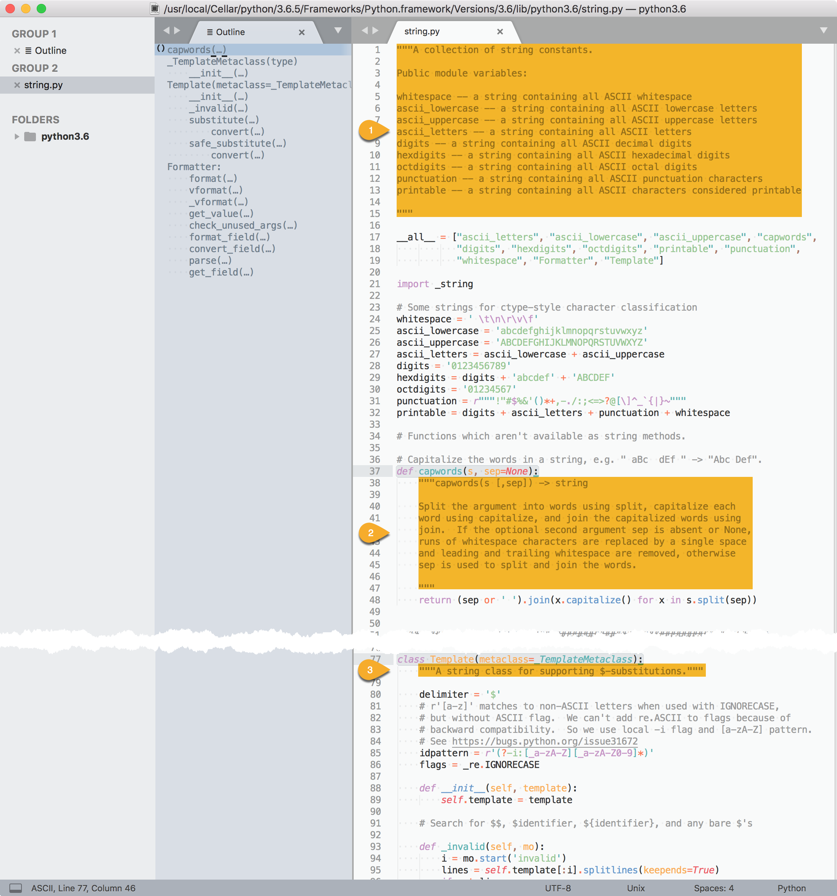

## Docs

[Documentation](https://www.python.org/doc/) » [Python 3.x Docs](http://docs.python.org/3/)  

[Glossary](https://docs.python.org/3/glossary.html)  

[The Python Language Reference](https://docs.python.org/3/reference/index.html)  
[The Python Standard Library](https://docs.python.org/3/library/index.html)  
[The Python Tutorial](https://docs.python.org/3.6/tutorial/)  

[Python Developer’s Guide](https://devguide.python.org/)  

[查看python的模块和函数帮助文档方法](http://blog.csdn.net/u013810296/article/details/55509284)  

## [help](https://docs.python.org/3/library/functions.html#help)

```shell
>>> help
Type help() for interactive help, or help(object) for help about object.
```

Invoke the built-in help system. (This function is intended for interactive use.) 

- If no argument is given, the **interactive help system** starts on the interpreter console.  
- If the argument is a string, then the string is looked up as the name of a module, function, class, method, keyword, or documentation topic, and a help page is printed on the console.  
- If the argument is any other kind of object, a help page on the object is generated.  

### help(object)

调用 `help('modules')` 可以列出当前所有已安装的模块：

```shell
>>> help(modules)
Traceback (most recent call last):
  File "<stdin>", line 1, in <module>
NameError: name 'modules' is not defined

>>> help('modules')

Please wait a moment while I gather a list of all available modules...

```

调用 `import(module)` 导入模块后，可调用 `help(module)` 查看模块帮助：

1. 调用  `help(module.function)` 查看静态函数 function 帮助。  
2. 调用  `help(module.class)` 查看类 class 帮助。  
3. 调用  `help(module.class.method)` 查看类成员函数 function 帮助。  

对于内置的 builtins 模块，以上三步可省掉 module 前缀：

```shell
# 查看 builtins 内建的 print 函数帮助
>>> help(print)

Help on built-in function print in module builtins:

# 查看 builtins 内建的 len 函数帮助
>>> help(len)

Help on built-in function len in module builtins:

len(obj, /)
    Return the number of items in a container.

# 查看 builtins 内建的 str 类帮助
>>> help(str)

Help on class str in module builtins:

# 查看 builtins 内建的 int 类帮助
>>> help(int)

Help on class int in module builtins:

class int(object)

# 查看 builtins 内建的 list 类帮助
>>> help(list)

Help on class list in module builtins:

class list(object)
 |  list() -> new empty list
 |  list(iterable) -> new list initialized from iterable's items
 |  

# 查看 builtins 内建的 set 类帮助
>>> help(set)

Help on class set in module builtins:

class set(object)
 |  set() -> new empty set object
 |  set(iterable) -> new set object
 |  
 |  Build an unordered collection of unique elements.

# 查看 builtins 内建的 set 类帮助
>>> help(dict)

Help on class dict in module builtins:

class dict(object)
 |  dict() -> new empty dictionary
```

若想调用 `help(module)` 查看 builtins 模块或其他模块帮助及说明，还得先显式 import 导入模块。

```shell
>>> # help(builtins)
>>> help(builtins)
Traceback (most recent call last):
  File "<stdin>", line 1, in <module>
NameError: name 'builtins' is not defined
>>> # 先 import 再 help
>>> import builtins
>>> help(builtins)

Help on built-in module builtins:

NAME
    builtins - Built-in functions, exceptions, and other objects.
>>>
>>> # help(string)
>>> help(string)
Traceback (most recent call last):
  File "<stdin>", line 1, in <module>
NameError: name 'string' is not defined
>>> # 先 import 再 help
>>>
>>> import string
>>> help(string)

Help on module string:

NAME
    string - A collection of string constants.
>>>
```


如果不 import 导入模块，加引号 `help('module')` 也可以查看模块帮助。

```shell
>>> help('array')

Help on module array:

NAME
    array

MODULE REFERENCE
    https://docs.python.org/3.6/library/array
```

#### quit

> `help(object)` 以 less/vi 模式打开帮助 manual page，底行输入 `q` 即可退出返回控制台。  
> 输入 `h` 可查看 less 命令帮助；输入 `?pattern` 或 `/pattern` 可执行前向/后向搜索。  

### help()

在 python 控制台中输入 `help()` 可打开交互式（`help> prompt`）帮助系统（help utility）。

```shell
>>> help()

Welcome to Python 3.6's help utility!

If this is your first time using Python, you should definitely check out
the tutorial on the Internet at https://docs.python.org/3.6/tutorial/.

Enter the name of any module, keyword, or topic to get help on writing
Python programs and using Python modules.  To quit this help utility and
return to the interpreter, just type "quit".

To get a list of available modules, keywords, symbols, or topics, type
"modules", "keywords", "symbols", or "topics".  Each module also comes
with a one-line summary of what it does; to list the modules whose name
or summary contain a given string such as "spam", type "modules spam".

help> 

```

从中我们可以获取到 Python 官方教程（The Python Tutorial）的网址为 <https://docs.python.org/3.6/tutorial/> 。

光标停留在 `help> ` 之后，可以输入 any module（name）、keywords 或 topics 查看模块、关键字、话题等相关帮助主题。

- `modules`：列出所有已安装模块  
- `keywords`：列出语言内置关键字  
- `symbols`：列出语言内置符号  
- `topics`：列出相关帮助主题  

#### keywords

输入 `keywords` 可以列出 Python 语言的内置关键字：

```shell
help> keywords

Here is a list of the Python keywords.  Enter any keyword to get more help.

False               def                 if                  raise
None                del                 import              return
True                elif                in                  try
and                 else                is                  while
as                  except              lambda              with
assert              finally             nonlocal            yield
break               for                 not                 
class               from                or                  
continue            global              pass                
```

通过 `help('keyword')` 可查看某个关键字 keyword 的说明。

- 如果不清楚 python 中 `in`, `is`, `as` 关系判断的区别，可调用 help(`in`)、help(`is`) 或 help(`as`) 查看相关说明；  
- 如果不清楚关键字 `None` 和 `not` 的区别，可调用 help(`None`) 或 help(`not`) 查看相关说明；  

以下通过 `help('pass')` 获取 pass 关键字的帮助说明。

```shell
>>> help('pass')

The "pass" statement
********************

   pass_stmt ::= "pass"

"pass" is a null operation --- when it is executed, nothing happens.
It is useful as a placeholder when a statement is required
syntactically, but no code needs to be executed, for example:

   def f(arg): pass    # a function that does nothing (yet)

   class C: pass       # a class with no methods (yet)
(END)
```

其他不熟悉或不清楚的 [nonlocal](https://docs.python.org/3.6/reference/simple_stmts.html#nonlocal), [global](https://docs.python.org/3.6/reference/simple_stmts.html#global), with 等关键字，均可通过此法获取其帮助说明。

#### symbols

输入 `symbols` 可以列出 Python 语言的内置符号：

```shell
help> symbols

Here is a list of the punctuation symbols which Python assigns special meaning
to. Enter any symbol to get more help.

!=                  *=                  <<                  ^
"                   +                   <<=                 ^=
"""                 +=                  <=                  _
%                   ,                   <>                  __
%=                  -                   ==                  `
&                   -=                  >                   b"
&=                  .                   >=                  b'
'                   ...                 >>                  j
'''                 /                   >>=                 r"
(                   //                  @                   r'
)                   //=                 J                   |
*                   /=                  [                   |=
**                  :                   \                   ~
**=                 <                   ]                   
```

#### [modules](https://docs.python.org/3.6/tutorial/modules.html)

输入 `modules` 可以列出当前所有已安装的模块：

```Shell
help> modules

Please wait a moment while I gather a list of all available modules...
```

> 等效于  `help('modules')`  

除此之外，还可以调用 `modules time` 查看所有名称或概要信息中包含 time 的模块。

```shell
help> modules time

Here is a list of modules whose name or summary contains 'time'.
If there are any, enter a module name to get more help.

time - This module provides various functions to manipulate time values.
_strptime - Strptime-related classes and functions.
datetime - Concrete date/time and related types.
test.ann_module3 - Correct syntax for variable annotation that should fail at runtime
test.datetimetester - Test date/time type.
test.test_datetime 
test.test_strftime - Unittest for time.strftime
test.test_strptime - PyUnit testing against strptime
test.test_time 
test.test_timeit 
test.test_timeout - Unit tests for socket timeout feature.
test.time_hashlib 
timeit - Tool for measuring execution time of small code snippets.
_datetime 
pip._vendor.urllib3.util.timeout 

```

> 在处理某一特定领域问题，想要看看现有的模块库支持时，基于关键字进行模糊匹配相当实用。

#### quit

通过快捷键 `<C-c>` / `<C-d>` 或 **`quit`** 可退出 help utility 命令行 `help> ` 回到 Python 主控制台 `>>> `。

```shell
help> quit

You are now leaving help and returning to the Python interpreter.
If you want to ask for help on a particular object directly from the
interpreter, you can type "help(object)".  Executing "help('string')"
has the same effect as typing a particular string at the help> prompt.
```

`help>` 输入 `module`（无需先 imprt）, `module.function`, `module.class`, `module.class.method` 可查看相关帮助。

退回到 `>>>` 中输入`help(module)`、`help(module.function)`、`help(module.class)`、`help(module.class.method)` 可查看等效帮助。  

### Docstring

A [docstring](https://www.python.org/dev/peps/pep-0257/#what-is-a-docstring) is a string literal that occurs as the **first** statement in a module, function, class, or method definition.  
Such a docstring becomes the `__doc__` special attribute of that object.



pydoc 模块自动根据 python 模块代码中各部分按约定格式定义的 docstring，聚合生成整个模块的帮助文档。

> The [pydoc](https://docs.python.org/3/library/pydoc.html?highlight=docstring#module-pydoc) module automatically generates documentation from Python modules.  

调用 `help()` 的输出实际上就是整个模块的 docstrings 或各个部分的 docstring。

> Calling `help()` on methods or functions displays the docstrings:  

[PEP 257 -- Docstring Conventions](https://www.python.org/dev/peps/pep-0257/)  
[使用Python的docstring](http://www.maixj.net/ict/python-docstring-16247)  

### `__doc__`

> python 中每个 module，每个 class，每个 def 都留有写 doc 的地方。

关于 `__doc__` 属性，参考 《[29.12.1. Types and members](https://docs.python.org/3/library/inspect.html#types-and-members)》。

- `print(module.__doc__)`：查看模块概述。

```shell
>>> # 查看 builtins 模块的 docstring
>>> import builtins
>>> print(builtins.__doc__)
Built-in functions, exceptions, and other objects.

Noteworthy: None is the `nil' object; Ellipsis represents `...' in slices.
>>>
>>> # 查看 string 模块的 docstring
>>> print(string.__doc__)
A collection of string constants.

Public module variables:

whitespace -- a string containing all ASCII whitespace
ascii_lowercase -- a string containing all ASCII lowercase letters
ascii_uppercase -- a string containing all ASCII uppercase letters
ascii_letters -- a string containing all ASCII letters
digits -- a string containing all ASCII decimal digits
hexdigits -- a string containing all ASCII hexadecimal digits
octdigits -- a string containing all ASCII octal digits
punctuation -- a string containing all ASCII punctuation characters
printable -- a string containing all ASCII characters considered printable
```

**注意**：先要 import module。

> `string.__doc__` 即 string.docstring 截图中定义在模块代码 `string.py` 首部三引号包括的多行注释部分（[Multi-line Docstrings](https://www.python.org/dev/peps/pep-0257/#id17)）—— ①。  
> 结合 help() 输出可知，包括紧随三引号后的 NAME 部分，以及间隔空行后的 DESCRIPTION 部分。  

- `print(class.__doc__)`（或 `print(object.__doc__)`）：查看类说明。  

```shell
>>> # 查看 builtins.str 类的 docstring
>>> print(str.__doc__)
str(object='') -> str
str(bytes_or_buffer[, encoding[, errors]]) -> str

Create a new string object from the given object. If encoding or
errors is specified, then the object must expose a data buffer
that will be decoded using the given encoding and error handler.
Otherwise, returns the result of object.__str__() (if defined)
or repr(object).
encoding defaults to sys.getdefaultencoding().
errors defaults to 'strict'.
>>>
>>> # 查看 string 模块的类 Template 的 docstring
>>> print(string.Template.__doc__)
A string class for supporting $-substitutions.
```

> `string.Template.__doc__` 即 string.docstring 截图中定义在模块代码 `string.py` 中 Template 类声明后的单行三引号注释部分（[One-line Docstrings](https://www.python.org/dev/peps/pep-0257/#id16)） —— ③。  

- `print(class.method.__doc__)`（或 `print(object.method.__doc__)`）：查看类成员函数说明。  

```shell
>>> # 查看 builtins.str 类的成员函数 format 的 docstring
>>> print(str.format.__doc__)
S.format(*args, **kwargs) -> str

Return a formatted version of S, using substitutions from args and kwargs.
The substitutions are identified by braces ('{' and '}').
>>>
>>> # 查看 string 模块的函数 capwords 的 docstring
>>> print(string.capwords.__doc__)
capwords(s [,sep]) -> string

    Split the argument into words using split, capitalize each
    word using capitalize, and join the capitalized words using
    join.  If the optional second argument sep is absent or None,
    runs of whitespace characters are replaced by a single space
    and leading and trailing whitespace are removed, otherwise
    sep is used to split and join the words.
```

> `string.capwords.__doc__` 即 string.docstring 截图中定义在模块代码 `string.py` 中 capwords 函数体首部三引号包括的多行注释部分 —— ②。  
> 结合 help() 输出可知，包括紧随三引号后的概要（summary line），以及间隔空行后（followed by a blank line）的详细说明部分（more elaborate description）。  

### inspect.getdoc

通过 inspect.getdoc(*object*) 接口亦可获取 object 对应的 docstring（documentation string）：

```shell
inspect.getdoc(object)
Get the documentation string for an object
```

`inspect.getdoc(str)` 等效于 `str.__doc__`  
`inspect.getdoc(string)` 等效于 `string.__doc__`  
`inspect.getdoc(string.Template)` 等效于 `string.Template.__doc__ `  
`inspect.getdoc(string.capwords)` 等效于 `string.capwords.__doc__ `  

## [dir()](https://docs.python.org/3/library/functions.html#dir)

The built-in function [dir()](https://docs.python.org/3.6/tutorial/modules.html#the-dir-function) is used to find out which names a module defines. It returns a sorted list of strings:

> Note that it lists all types of names: variables, modules, functions, etc.  
> [dir()](https://docs.python.org/3.6/library/functions.html#dir) does not list the names of built-in functions and variables.  

内置模块 builtins 提供的 `dir()` 方法用于列举类或实例的属性方法。

可导入 builtins 模块，然后调用 `help(builtins.dir)` 查看帮助：

```
>>> import builtins
>>> help(builtins.dir)
```

由于 builtins 模块已经内置到解释器，因此对于其中的类或函数，可省去 import，直接调用 help 或访问其 `__doc__` 查看 `dir()` 函数的说明。

```shell
# 也可执行 print(dir.__doc__) 查看概要

>>> help(dir)

Help on built-in function dir in module builtins:

dir(...)
    dir([object]) -> list of strings
    
    If called without an argument, return the names in the current scope.
    Else, return an alphabetized list of names comprising (some of) the attributes
    of the given object, and of attributes reachable from it.
    If the object supplies a method named __dir__, it will be used; otherwise
    the default dir() logic is used and returns:
      for a module object: the module's attributes.
      for a class object:  its attributes, and recursively the attributes
        of its bases.
      for any other object: its attributes, its class's attributes, and
        recursively the attributes of its class's base classes.
```

例如执行 `dir(builtins)` 可查看模块 builtins 提供的所有属性及方法：

```shell
>>> import builtins
>>> dir(builtins)
```

	> 也可执行 `print(builtins.__dict__)` 打印 builtins 模块的符号表。

### autocompletion

在 python3 控制台中，对于明确类型的对象，输入引用符点号（`.`）后，再按下 tab 会列举所有可能的成员函数或属性：

```shell
>>> str1='hello'
>>> str1.
str1.capitalize(    str1.isalnum(       str1.join(          str1.rsplit(
str1.casefold(      str1.isalpha(       str1.ljust(         str1.rstrip(
str1.center(        str1.isdecimal(     str1.lower(         str1.split(
str1.count(         str1.isdigit(       str1.lstrip(        str1.splitlines(
str1.encode(        str1.isidentifier(  str1.maketrans(     str1.startswith(
str1.endswith(      str1.islower(       str1.partition(     str1.strip(
str1.expandtabs(    str1.isnumeric(     str1.replace(       str1.swapcase(
str1.find(          str1.isprintable(   str1.rfind(         str1.title(
str1.format(        str1.isspace(       str1.rindex(        str1.translate(
str1.format_map(    str1.istitle(       str1.rjust(         str1.upper(
str1.index(         str1.isupper(       str1.rpartition(    str1.zfill(
```

借此特性，在编码过程中，可一览某一类别实例的可用属性、方法。

对于 Sublime Text 等文本编辑器，需要借助 [Anaconda](https://www.anaconda.com/) 或 [SublimeLinter-pycodestyle](https://github.com/SublimeLinter/SublimeLinter-pycodestyle) 等插件来实现自动完成智能提示。

## Source Code

### `__file__`

关于 `__file__` 属性，参考 《[29.12.1. Types and members](https://docs.python.org/3/library/inspect.html#types-and-members)》。

在 python 主控制台中直接输入 `module`、`module.function`、` module.class`、` module.class.method` 也会显示其路径或类型等信息：

```shell
>>> import builtins
>>> builtins
<module 'builtins' (built-in)>

>>> builtins.print
<built-in function print>

>>> builtins.str
<class 'str'>

>>> builtins.str.format
<method 'format' of 'str' objects>

>>> import sys
>>> sys
<module 'sys' (built-in)>

>>> import os
>>> os
<module 'os' from '/usr/local/Cellar/python/3.6.5/Frameworks/Python.framework/Versions/3.6/lib/python3.6/os.py'>

>>> import array
>>> array
<module 'array' from '/usr/local/Cellar/python/3.6.5/Frameworks/Python.framework/Versions/3.6/lib/python3.6/lib-dynload/array.cpython-36m-darwin.so'>
```

在终端执行 python(3) 启动时，可携带 `-v` 选项，将输出详细的模块加载信息：

```shell
-v     : verbose (trace import statements); also PYTHONVERBOSE=x
         can be supplied multiple times to increase verbosity
```

---

另外，也可打印模块的 `__file__` 属性来查看模块路径信息。

```shell
# builtins 模块未定义该属性
>>> import builtins
>>> builtins.__file__
Traceback (most recent call last):
  File "<stdin>", line 1, in <module>
AttributeError: module 'builtins' has no attribute '__file__'

# sys 模块未定义该属性
>>> import sys
>>> sys.__file__
Traceback (most recent call last):
  File "<stdin>", line 1, in <module>
AttributeError: module 'sys' has no attribute '__file__'

# os 模块对应 Python 源码
>>> import os
>>> os.__file__
'/usr/local/Cellar/python/3.6.5/Frameworks/Python.framework/Versions/3.6/lib/python3.6/os.py'

# array 模块对应 cpython 实现动态库
>>> import array
>>> array.__file__
'/usr/local/Cellar/python/3.6.5/Frameworks/Python.framework/Versions/3.6/lib/python3.6/lib-dynload/array.cpython-36m-darwin.so'

```

#### study the source code

初学 Python 的一种有效途径是阅读 python 标准模块源码，通过阅读源码可观摩编码规范，了解语言风格，快速掌握 Python 程序设计的一般流程。

找到对应模块的 Python 源码路径，我们便可以[使用文本编辑器打开](http://www.cnblogs.com/IPYQ/p/5672922.html)进行研读。  

`os.system('open '+module.__file__)`：调用 open 使用默认文本编辑器打开 module 源码：

```shell
>>> import argparse
>>> import os
# 调用 open 命令打开 argparse 模块源码
>>> os.system('open '+argparse.__file__)

# 调用 subl 命令打开 argparse 模块源码
>>> os.system('subl '+argparse.__file__)
```

当然，我们也可以先切换工作目录到 python 库源码目录，再调用 `os.system('open '+'module'+'.py')`。

```shell
>>> import os

# 获取当前工作目录并记录
>>> os.getcwd()
'/Users/faner'
>>> last_cwd=os.getcwd()

# 修改工作目录
>>> os.chdir('/usr/local/Cellar/python/3.6.5/Frameworks/Python.framework/Versions/3.6/lib/python3.6/')
>>> os.getcwd()
'/usr/local/Cellar/python/3.6.5/Frameworks/Python.framework/Versions/3.6/lib/python3.6'

# 调用 open 命令打开 python 库源码目录
>>> os.system('subl '+os.getcwd())
0

# 调用 subl 命令打开 python 库源码目录
>>> os.system('subl '+os.getcwd())
0

# 调用 open 命令打开指定 python 源码
>>> os.system('open '+'argparse'+'.py')
0

# 调用 subl 命令打开指定 python 源码
>>> os.system('subl '+'argparse'+'.py')
0
```

调用 subl 命令打开 python 库源码目录，可使用 Sublime Text 强大的搜索和定位功能进行高效阅读。

阅读 `base64.py` 可知内部调用了基础库 binascii，其为解释器内置模块（`binascii.cpython-36m-darwin.so`）。

```shell
>>> import binascii
>>> binascii
<module 'binascii' from '/usr/local/Cellar/python/3.6.5/Frameworks/Python.framework/Versions/3.6/lib/python3.6/lib-dynload/binascii.cpython-36m-darwin.so'>
```

参考 [cpython](https://github.com/python/cpython) 的 [binascii.c.h](https://github.com/python/cpython/blob/master/Modules/clinic/binascii.c.h)。

#### openPythonModuleCode

`openPythonModuleCode.py` 脚本用于打开指定名称的模块的源代码：

```python
#!/usr/bin/env python
# -*- coding: UTF-8 -*-

import os
import sys
import importlib


def open_module_source_code(str_module_name):
    try:
        dynamic_module = importlib.import_module(str_module_name)
        str_cmd = 'subl '  # 'open '
        str_file = dynamic_module.__file__
        dot_idx = str_file.rindex(os.extsep)
        file_ext = str_file[(dot_idx + 1):]
        if file_ext == 'py':
            print('execute system command: ', str_cmd + str_file)
            os.system(str_cmd + str_file)
        else:  # 'module.cpython*.so'
            # file_name_idx = str_file.rindex(os.sep)
            # file_name = str_file[file_name_idx+1:]
            print('module file: ', str_file)
    except (ImportError, AttributeError, ValueError) as e:
        print(e)
        sys.exit()
    pass


def main(args):
    open_module_source_code(args[0])
    pass


# main entry
if __name__ == '__main__':
    print('This program is being run by itself')
    if len(sys.argv) < 2:
        print('please input module name')
    else:
        main(sys.argv[1:])
else:
    print('I am being imported from another module')

```

以下为几组执行结果：

```shell
# ImportError
faner@MBP-FAN:~/Projects/python|⇒  python3 openPythonModuleCode.py arg
This program is being run by itself
No module named 'arg'

# AttributeError
faner@MBP-FAN:~/Projects/python|⇒  python3 openPythonModuleCode.py builtins
This program is being run by itself
module 'builtins' has no attribute '__file__'

# cpython.so
faner@MBP-FAN:~/Projects/python|⇒  python3 openPythonModuleCode.py array
This program is being run by itself
module file:  /usr/local/Cellar/python/3.6.5/Frameworks/Python.framework/Versions/3.6/lib/python3.6/lib-dynload/array.cpython-36m-darwin.so

# python
faner@MBP-FAN:~/Projects/python|⇒  python3 openPythonModuleCode.py argparse
This program is being run by itself
execute system command:  subl /usr/local/Cellar/python/3.6.5/Frameworks/Python.framework/Versions/3.6/lib/python3.6/argparse.py

```

### inspect

[How do I find the location of Python module sources?](https://stackoverflow.com/questions/269795/how-do-i-find-the-location-of-python-module-sources)

除了通过 `__file__` 属性外 ，还可通过 inspect 模块提供的一些接口，来查看某个类、对象或函数所属模块以及源文件等信息。参考 [29.12.2. Retrieving source code](https://docs.python.org/3/library/inspect.html#retrieving-source-code) 章节。

#### inspect.getfile

`inspect.getfile(object)` 接口用于获取定义 object（模块、类或函数）的文件，python 源码或 cpython 动态库（so）。

```shell
inspect.getfile(object)
Return the name of the (text or binary) file in which an object was defined. This will fail with a TypeError if the object is a built-in module, class, or function.
```

对于内置模块、类或函数，调用该接口将报 TypeError 异常。

```shell
>>> # string 模块的代码
>>> inspect.getfile(string)
'/usr/local/Cellar/python/3.6.5/Frameworks/Python.framework/Versions/3.6/lib/python3.6/string.py'
>>>
>>> # array 模块的 cpython 实现 so
>>> inspect.getfile(array)
'/usr/local/Cellar/python/3.6.5/Frameworks/Python.framework/Versions/3.6/lib/python3.6/lib-dynload/array.cpython-36m-darwin.so'
>>>
>>> # str 类为内置 built-in class，报 TypeError 异常
>>> inspect.getfile(str)
Traceback (most recent call last):
  File "<stdin>", line 1, in <module>
  File "/usr/local/Cellar/python/3.6.5/Frameworks/Python.framework/Versions/3.6/lib/python3.6/inspect.py", line 654, in getfile
    raise TypeError('{!r} is a built-in class'.format(object))
TypeError: <module 'builtins' (built-in)> is a built-in class
```

#### inspect.getsourcefile

`inspect.getsourcefile(object)` 接口用于获取定义 object（模块、类或函数）的 python 源文件。

```shell
inspect.getsourcefile(object)
Return the name of the Python source file in which an object was defined. This will fail with a TypeError if the object is a built-in module, class, or function.
```

对于通过 cpython.so 动态库提供的模块接口，没有 python 源码，返回空。  
对于内置模块、类或函数，调用该接口将报 TypeError 异常。  

```shell
>>> # string 模块的代码
>>> inspect.getsourcefile(string))
/usr/local/Cellar/python/3.6.5/Frameworks/Python.framework/Versions/3.6/lib/python3.6/string.py
>>>
>>> # array 模块的源码？
>>> inspect.getsourcefile(array)
>>> 
>>> # str 类为内置 built-in class，报 TypeError 异常
>>> inspect.getsourcefile(str)
Traceback (most recent call last):
  File "<stdin>", line 1, in <module>
  File "/usr/local/Cellar/python/3.6.5/Frameworks/Python.framework/Versions/3.6/lib/python3.6/inspect.py", line 684, in getsourcefile
    filename = getfile(object)
  File "/usr/local/Cellar/python/3.6.5/Frameworks/Python.framework/Versions/3.6/lib/python3.6/inspect.py", line 654, in getfile
    raise TypeError('{!r} is a built-in class'.format(object))
TypeError: <module 'builtins' (built-in)> is a built-in class
```

#### inspect.getsource

`inspect.getsource(object)` 接口用于获取 object（模块、类或函数）的 python 实现源码。

```shell
inspect.getsource(object)
Return the text of the source code for an object. The argument may be a module, class, method, function, traceback, frame, or code object. The source code is returned as a single string. An OSError is raised if the source code cannot be retrieved.
```

对于内置模块(builtins) 等以 so 形式未提供 python 源码，将报 TypeError 异常。

```shell
>>> # 解释器控制台输出 string.Template.substitute 实现源码
>>> inspect.getsource(string.Template.substitute))
    def substitute(*args, **kws):
        if not args:
            raise TypeError("descriptor 'substitute' of 'Template' object "
                            "needs an argument")
        self, *args = args  # allow the "self" keyword be passed
        if len(args) > 1:
            raise TypeError('Too many positional arguments')
        if not args:
            mapping = kws
        elif kws:
            mapping = _ChainMap(kws, args[0])
        else:
            mapping = args[0]
        # Helper function for .sub()
        def convert(mo):
            # Check the most common path first.
            named = mo.group('named') or mo.group('braced')
            if named is not None:
                return str(mapping[named])
            if mo.group('escaped') is not None:
                return self.delimiter
            if mo.group('invalid') is not None:
                self._invalid(mo)
            raise ValueError('Unrecognized named group in pattern',
                             self.pattern)
        return self.pattern.sub(convert, self.template)
>>> 
>>> # array 模块以 so 提供，未提供 python 源码，报 TypeError 异常
>>> inspect.getsource(array)
Traceback (most recent call last):
  File "<stdin>", line 1, in <module>
  File "/usr/local/Cellar/python/3.6.5/Frameworks/Python.framework/Versions/3.6/lib/python3.6/inspect.py", line 968, in getsource
    lines, lnum = getsourcelines(object)
  File "/usr/local/Cellar/python/3.6.5/Frameworks/Python.framework/Versions/3.6/lib/python3.6/inspect.py", line 955, in getsourcelines
    lines, lnum = findsource(object)
  File "/usr/local/Cellar/python/3.6.5/Frameworks/Python.framework/Versions/3.6/lib/python3.6/inspect.py", line 778, in findsource
    raise OSError('source code not available')
OSError: source code not available
>>>
>>> # str 定义在内置模块(builtins)，以 so 提供，未提供 python 源码，报 TypeError 异常
>>> inspect.getsource(str)
Traceback (most recent call last):
  File "<stdin>", line 1, in <module>
  File "/usr/local/Cellar/python/3.6.5/Frameworks/Python.framework/Versions/3.6/lib/python3.6/inspect.py", line 968, in getsource
    lines, lnum = getsourcelines(object)
  File "/usr/local/Cellar/python/3.6.5/Frameworks/Python.framework/Versions/3.6/lib/python3.6/inspect.py", line 955, in getsourcelines
    lines, lnum = findsource(object)
  File "/usr/local/Cellar/python/3.6.5/Frameworks/Python.framework/Versions/3.6/lib/python3.6/inspect.py", line 768, in findsource
    file = getsourcefile(object)
  File "/usr/local/Cellar/python/3.6.5/Frameworks/Python.framework/Versions/3.6/lib/python3.6/inspect.py", line 684, in getsourcefile
    filename = getfile(object)
  File "/usr/local/Cellar/python/3.6.5/Frameworks/Python.framework/Versions/3.6/lib/python3.6/inspect.py", line 654, in getfile
    raise TypeError('{!r} is a built-in class'.format(object))
TypeError: <module 'builtins' (built-in)> is a built-in class
```